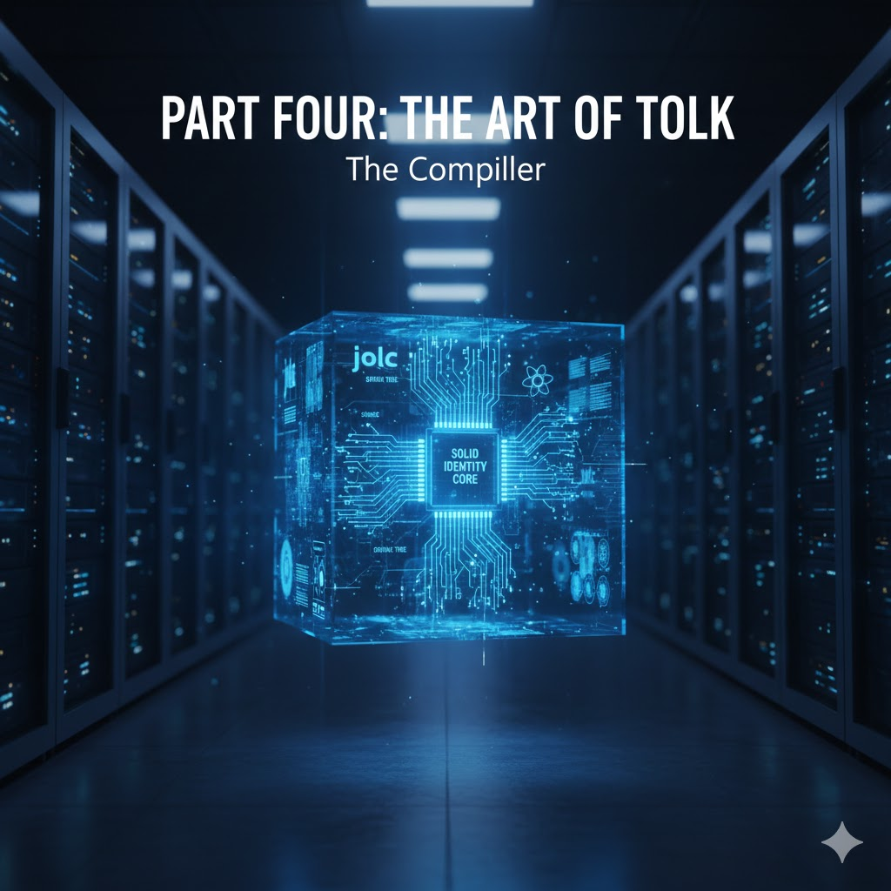

# JOLK

**Messages in Motion**

**The Language and its Transpilation**

**Building Industrial-Strength Message-Passing Systems on the JVM**

Cobalt is a deep blue. It pays homage to the original "Blue Book"[1] while signalling a modern evolution of language principles. In engineering, cobalt is associated with high-strength alloys; similarly, this volume proposes the conceptual foundation for building industrial-strength systems.

Messages in Motion defines the fundamental experience of the language-dynamic; receiver-centric and fluid. This alludes to the Object-Oriented research of Alan Kay at Xerox PARC, he viewed objects as "biological cells" or "physical entities" that communicate through messages and where computation is not viewed as a sequence of procedural calls, but as a dynamic flow of messages between autonomous objects. Jolk takes Kay’s original vision[2] [3]  to its logical conclusion: everything is executed through messages.

Messages in Motion is a tribute to the core philosophy of Smalltalk, a thematic play on two significant concepts in computer science history, “Object” and “Message”, blended with the specific mechanics of the Jolk runtime. The industry often focused on the "Object" as a container and in traditional Java, method call execution feels very procedural. In Jolk, messages are "in motion", and drive the systems.

---

# Introduction

**Jolk: Fluidity &  Integrity**

---

In the early eighties, a blue-covered volume changed the trajectory of software engineering by defining a world where "everything is an object." That world was built on the elegance of the message. However industrial computing moved toward the robust but often rigid structures of the Java Virtual Machine (JVM). The fluid "talk" of the pioneers was replaced by the heavy "syntax" of the enterprise. This book outlines the architectural framework of the **Jolk** language, an experimental project designed to unify the industrial reliability of **Java** with the dynamic ergonomics of **Smalltalk-80**.

Jolk /dʒɔːk/ (The name is a blend of “JVM” and the Dutch word “tolk”, meaning "translator" or "interpreter", alluding to the "talk" in Smalltalk) is a technical specification designed to execute Smalltalk-inspired message-passing on the Java Virtual Machine. The Tolk compiler translates receiver-centric logic into high-performance bytecode, aiming for zero performance overhead. In doing so, Jolk serves as a modern implementation of the objectives established in our earlier work on ProtoTyping[4], which sought to reconcile the high-level abstraction of object-oriented systems with a neat and consistent typing structure to provide a powerful and efficient programming instrument. Furthermore, Jolk incorporates a rigorous static type system inspired by Strongtalk[5] and implemented for the Java type system, enabling compile-time verification of message sends to ensure the reliability and structural safety necessary for large-scale production environments. The Tolk is more than just a compiler; it is a semantic envoy. It takes the "Messages in Motion"—the dynamic, minimalist intent of the programmer—and maps them onto the JVM with zero-overhead precision.

This book is divided into two halves, mirroring the two halves of the Jolk philosophy. First, we explore The Language: a pursuit of "Unified Minimalism" where control keywords vanish, and the distinction between state and behaviour dissolves into a single, consistent message-passing protocol. Second, we dive into the Java interoperability through the Tolk compiler: a technical look at how we leverage invokedynamic, monomorphic call-site optimisation, and the reification of the meta-class to ensure that Jolk performs at the speed of native Java.

We invite you to stop "calling methods" and start "sending messages." Welcome to Jolk.

## Design Philosophy

Jolk is architected as a minimalist language for the JVM, an exploration of Java evolution through the omission of procedural legacy and the implementation of a pure message-passing object model. This design leverages the elimination of keywords, the treatment of classes as first-class objects, and the enforcement of a unified messaging syntax.

### Principles

**Object-Oriented Purity**: Everything—including closures, booleans, and the null identity—behaves as an object, receptive to messages.

**Unified Messaging:** Instantiation, expression evaluation, control flow, dependency injection, concurrency and error handling, every interaction is a message send.

**Data Confinement**: The strict isolation of state that restricts an object’s methods to accessing only its own instance fields or meta-variables for use in assignments, expressions, and method chains, while limiting all mutation to the local internal context.

**Strong Typing:** Jolk's type system is inspired by Strongtalk, bringing rigorous static typing to a message-based model. Jolk retains the use of brackets for generics primarily to ensure parsing stability and to provide a deterministic grammar.

**Minimalist Syntax:** A reduced keyword set.

**Syntactic Alignment**: The C-derived syntax and familiar notation reduce cognitive load for Java developers.

### Architectural Outcomes

Jolk addresses the "Complexity Gap" in modern software engineering by offering:

**Developer friendly:** Designed to assist the developer with a simple, elegant but powerful language model.

**Reduced Technical complexity:** Unified messaging for control flow and error handling removes the maintenance burden of traditional branching structures.

**Performance without Verbosity:** Jolk matches Java's execution speed through aggressive inlining (Tolk) while maintaining a minimal complexity footprint.

**Zero-Cost Interoperability:** By targeting native bytecodes and adhering to the Java ecosystem, Jolk achieves seamless integration. Free of translation layers, Jolk is architected from the outset for interoperability, ensuring it operates as a "polite citizen" within the JVM.

**Future Proofness**: Build for the JVM Jolk will benefit from the Java evolution brought by projects Valhalla & Amber.

By eliminating syntactic noise and formalising message-passing, Jolk bridges the elegance of Smalltalk with optimised JVM execution.

## *Me, Myself and I*

*The Jolk philosophy defines the object not as a container, but as an identity manifested through message-driven interactions.*

*The Receiver (Me) constitutes the terminus for invocations, while the Meta-Awareness (Myself) instantiates the @Intrinsic reflective substrate required to map high-level abstractions to the JVM. The Identity (I) asserts the instance as a first-class, non-nullable entity. Adherent to Kay’s vision, these components are mediated by a Metaboundary that enforces strict local retention, thereby effecting the "disappearance of data."* 

*This paradigm supersedes keyword-driven control flow with a deterministic exchange of messages, formalising branching as a first-class participant within a unified communicative field.*

---

# Part One

**The Semantics of Motion**

---

## Grammar

Jolk blends the structural discipline and familiar Java syntax of Java with Smalltalk’s pure message-passing philosophy, resulting in a robust, industry-ready grammar that combines strict state encapsulation with a natural, human-readable syntax designed to reduce cognitive load through intuitive mathematical hierarchies and expressive, lazy-evaluated control flow.

    (* Jolk Grammar *)
    (* ============ *)
	
	unit            = [ package ] { import } { annotation } ( type_decl | extension_decl)  
	package         = "package" namespace  ";"  
	import          = "import" namespace [ ".*" ] ";"  
	namespace       = identifier { "." identifier }

	type_decl       = [ visibility ] [ variability ] archetype type_bound "{" { type_mbr } "}"
	visibility      = "public" | "package" | "protected" | "private"
	variability     = "abstract" | "final"
	archetype       = "class" | "value" | "record" | "enum" | "protocol"
	type_bound      = type [ type_contracts ]
	type            = "Self" | [ namespace ] meta_id [ type_args ]
	type_args       = "[" type_bound { "," type_bound } "]"
	type_contracts  = [ "extends" type ] [ "implements" type { "&" type } ]
	type_mbr        = { annotation } ( [ "meta" ] [ visibility ] member | enum ";" )
	member          = state | field | [ variability ] method
	state           = "constant" type binding ";"
	binding         = identifier assignment
	assignment      = "=" expression
	field           = type identifier [ assignment ] ";"
	enum            = meta_id [ "(" argument_list ")" ]
	method          = [ "lazy" ] [ type_args ] type selector_id "(" [ typed_params ] ")" ( block | ";" )
	selector_id     = identifier | operator
	typed_params    = annotated_type ( instance_id { "," annotated_type instance_id } [ "," annotated_type vararg_id ] |  vararg_id )
	annotated_type  = { annotation } type
	annotation      = "@" identifier [ "(" ... ")" ]
	vararg_id       = "..." instance_id
	extension_decl  = "extension" meta_id "extends" type "{" { extension_mbr } "}"
	extension_mbr   = { annotation } [ visibility ] [variability] method

	statement       = state | binding | [ "^" ] expression
	expression      = logic_or [ ("?" | "?!") expression [ ":" expression ] ] (* ternary pattern *)
	logic_or        = logic_and { "||" logic_and }
	logic_and       = equality { "&&" equality }
	equality        = comparison { ( "==" | "!=" | "~~" | "!~" ) comparison }
	comparison      = term { ( ">" | ">=" | "<" | "<=" ) term } 
	term            = factor { ( "+" | "-" ) factor }
	factor          = unary { ( "*" | "/" | "%" ) unary }
	unary           = ( "!" | "-" ) unary | power
	power           = message [ "**" unary ]
	message         = primary { selector [ ( "(" argument_list ")" | block ) ] }
	primary         = reserved | identifier | literal | list_literal | "(" expression ")" | block
	argument_list   = argument { "," argument }
	argument        = expression | lambda
	block           = "{" [ stat_params "->" ] [ statement { ";" statement } [ ";" ] ] "}"
	lambda          = ( instance_id | "(" [ stat_params ] ")" ) "->" statement
	stat_params     = typed_params | inferred_params
	inferred_params = instance_id { "," instance_id }

	reserved        = "true" | "false" | "null" | "super" | "self" | "Self"
	selector        = "#" identifier
	identifier      = meta_id | instance_id 
	meta_id         = upper_alpha { alpha | digit }
	instance_id     = lower_alpha { alpha | digit }
	literal         = number_literal | string_literal | char_literal
	list_literal    = array_literal | set_literal | map_literal
	array_literal   = "#[" [ literal_list ] "]"
	set_literal     = "#{" [ literal_list ] "}"
	map_literal     = "#(" [ map_list ] ")"
	literal_list    = expression { "," expression }
	map_list        = map_entry { "," map_entry }
	map_entry       = expression "->" expression
	number_literal  = digit { digit } [ "." digit { digit } ]
	string_literal  = "\"" { char } "\""
	char_literal    = "'" char "'"

	visibility_ops  = "#" { "<" | "~" | "v" | ">" | "?" | "!" } 

The Jolk grammar follows a "DRY" (Don't Repeat Yourself) architecture by decoupling lexical primitives from functional layout rules. By isolating atomic tokens like sp (space) and nl (newline) from higher-level abstractions like w (mandatory whitespace for message sends) and `s` (optional separation for blocks), the specification enforces strict syntactic signatures—such as the required space between objects and selectors—while maintaining implicit flexibility elsewhere. This technical separation ensures a robust, hierarchical structure that optimizes both compiler performance and human readability.

The syntax for structural anchors like package, import, and class is designed to be almost identical to Java. This syntax allows Jolk to closely integrate with the existing Java ecosystem and ensures 100% interoperability with existing enterprise systems.

Furthermore, Jolk retains specific Java-like structures for record, enum, and value types to maintain strict compatibility with modern JVM features such as Project Valhalla. The decision to keep bracketed syntax for generics was made to ensure parsing stability and prevent recursive descent issues when the compiler processes complex nested types.

Jolk includes explicit modifiers such as public, abstract, and final because they are considered necessary in large-scale engineering.  By combining the structural safety of the C-family with Smalltalk’s message-passing soul, Jolk’s syntax provides a bridge between expressiveness and high-performance.

The Jolk syntax is defined by its pure object-oriented minimalism, aiming to reduce the "Complexity Gap" of industrial languages by treating every interaction as a message send. Jolk achieves a *Syntax Minimum* through a lean keyword palette of structural anchors like class and reserved identifiers like self. By restricting the assignment operator to local identifiers and requiring message-based interaction for all state changes, the language replaces procedural noise with high-level intent, ensuring total encapsulation and structural clarity.

### Keywords

In Jolk, distinguishing between *Structural Scaffolding* and *Reserved Object Identifiers* is essential for highlighting the language's minimal core. By classifying Reserved Object Identifiers as the fundamental operators that define an object’s identity and awareness, while treating structural keywords as Architectural Metadata, the language's primary vocabulary remains incredibly focused.  

**Reserved Object Identifiers:** These keywords represent the fundamental mechanics of the object model: Identity, Awareness, and Literals.They are pre-defined identifiers for First-class Identities.

* `self`: Represents the current instance.  
* `super`: Represents the parent context/identity.  
* `Self`: Represents the meta-awareness of the type itself.  
* `null`: (The refined replacement for null) representing the absence of an object.  
* `true` / `false`: The fundamental boolean object literals.

**Structural Scaffolding** (Architectural Metadata): These markers tell the compiler how to organise the code into the JVM ecosystem, but they do not participate in the message-passing flow.

* *Structure / Metadata*: package, import, class, value, record, enum, protocol, extension  
* *Relations / Hierarchy*: extends &  implements are hierarchy markers  
* *Access / Visibility*: meta, public, protected, private, package, abstract, final , constant

### Lexical Anchors

**Operators**: Expressed as mathematical or logical symbols (e.g., `+`, `-`, `==`, `!=`, `~~`, `!~`).

**Returns**: Jolk uses the caret `^` as an explicit return symbol. If a return type is Self in a method declaration and no explicit return is specified, it implicitly returns self to facilitate fluent API 

**Selectors**: Identified by an anchor hashtag (`#`) followed by a string (e.g., `#print`, `#PI`). This approach treats logic as a fluent, pipe-like chain (e.g., `this #name #uppercase #print`, `Math #PI`), significantly reducing the "ceremony" of nested parentheses.

The Capitalisation Rule, also referred to as **Semantic Casing** is a core lexical rule in the Jolk language where the first-letter casing of an identifier determines its semantic category and role:

* Meta-Objects: Types, constants and class selectors start with an Uppercase letter (e.g., `String`, `PI`, `#PI`)  
* Variables, Parameters Properties & instance selectors: start with a lowercase letter (e.g., `name`, `#name`).

**Visibility**; The anchors (`#<` , `#~` , `#v`,  `#>`, `#?` , `#!`) designate the Membership Scope of an identifier, establishing the Lexical Fence that regulates message reception and the valid reach of the identity.

**Annotations**: These are anchored by the at-symbol (`@`). When the Tolk lexer sees this character, it immediately tags the token as an annotation.

### Structural Anchors

Syntactic elements act as structural anchors for the parser. 

**& Operator** instead of a comma for protocol implementation emphasizes that a type is a logical conjunction of behavioral contracts, shifting the focus from a procedural list to a mathematically precise intersection of multiple algebras while reinforcing the architectural separation between a singular implementation lineage (inheritance) and a multi-faceted subtyping lattice (protocols).

**Generic Type Brackets** While the final specification adopts `< >` to achieve alignment with Java and the Strongtalk lineage, the current version utilises `[ ]` to minimize lexical complexity.

**Closures** are brace-delimited {} and can act as receivers for control-flow messages. They utilize trailing closure syntax, where the logic block follows the message arguments directly. Parameters within a closure are separated from the logic by an `-`> arrow.

**Whitespace Strictness**: To reinforce their role as anchors for a preceding message, Jolk permits no whitespace between a selector and the opening brace (`{`) of a closure.

**Assignment**: Syntactically, the assignment symbol (`=`) acts as a structural anchor by occupying the lowest possible precedence. This ensures that the entire logic chain to the right is fully evaluated before the result is bound to an identifier. Assignments are viewed as a metalevel change from functions. In this sense, the (`=`) symbol acts as a "fence" that guards the crossing of a boundary from pure functional evaluation to a state-changing operation.

**Collection Literals**: A collection literal (Array, Set or Map) is a shorthand for the underlying message-based variadic creation of a primary object, ready to participate in the message chain. 

**meta**: The meta stratum anchor designates non-instance members, defining their association with type-level metadata and enforcing member segregation between the Instance and Meta Strata.

**lazy**: The temporality lazy directive designates deferred member initialisation, facilitating the creation of an identity only upon the reception of its primary message. 

## Semantics

In the Jolk ecosystem, reserved words are tokens that occupy a middle ground between the grammar and the object model. While they are not rigid language keywords like class, they are names with pre-defined semantic meaning that the Tolk toolchain protects.

### Unified Message-Passing

Jolk is built on Unified Message-Passing, where every interaction follows the *Receiver \#Message* pattern. This enforces strict encapsulation; whether you are instantiating an object (`User #new`), accessing a property (`user #name`), performing math (`1 + 2`) or specify control flow (`#case`), you are sending a message. Parentheses are omitted for unary selectors, and standard operators are treated as Binary Messages.

### Keyword-less Control Flow

By replacing rigid keywords with an intrinsic messaging protocol, Jolk shifts control flow from a structural language constraint to an emergent property of object interaction. Logic is implemented as a library feature rather than a compiler construct, ensuring that even fundamental branching obeys the same rules of encapsulation as user-defined code.

*Branching*: Traditional if-else blocks are replaced by the ternary pattern `condition ? {closure} : (expression | closure)`. Here, `?` and `:` are classified as Structural Selectors—grammatical delimiters that are semantically resolved as messages sent to Boolean identities to determine which branch is reified.  
*Looping*: Native while and for statements are superseded by messages sent to Closures or Integers, such as `{cond} #while {body} or 10 #times {n -> ...}`.  
*Error Handling*: Exception logic is unified with the messaging model, replacing try/catch with `#catch` and `#finally` messages sent directly to closures.

### Type System

The Jolk type system fully aligns with the Java generics syntax. The grammar distinguishes between five archetypes ( `class`, `enum`, `record`, and `value`) which serve as structural anchors in the EBNF.

Protocol conjunctions utilize the ampersand operator (`&`) to create 'branded' types that represent a mathematically precise intersection of contracts. Aligning with the concept of Traits[6], this allows for the composition of behavior without the state problems of multiple inheritance. This isn't just syntactic sugar; it is a structural guarantee that ensures the Identity of the participant and the Contract of the Message remain visible and secure, preventing semantically incompatible objects from accidentally matching based on syntax alone. Finally, the syntax enables extensions that permits augmentation of types with new messages.

Primitives are absent from the syntax because Jolk follows a pure object-oriented model where everything—including numbers, truth values, and the absence of a value (`null` a singleton instance of the `Nothing` class) —is a first-class object. This removal of the primitive/object distinction maintains a minimalist syntax while ensuring that every entity maintains a non-nullable identity.

### Mathematical and Equality Operators

Jolk distinguishes between Identity (`==` and the negation `!=`), which executes a JVM reference parity check, and Equivalence (`~~` and the negation `!~`), which executes a structural state comparison (`Objects.equals`). All mathematical symbols are treated as overloaded selectors, allowing custom types to interact like native primitives.

In accordance with the principle of Engineered Integrity, Jolk prioritises source code clarity over the brevity of general type inference. While operators provide fluidity, the language mandates explicit type signatures and the use of the Caret (`^`) operator for Query Methods. This ensures Protocol Transparency, preventing "Inference Fog" by requiring that the "Contract of the Message" remains visible at every step of the execution flow. This discipline ensures that the developer always understands the state of the message chain without relying on external IDE tooling to resolve implicit types.

### Statement Termination 

Statement Termination Logic balances structural discipline with the fluid message-passing ergonomics. The semicolon is mandatory for architectural metadata, such as package and import declarations, as well as instance state declarations like fields and enums. Within method bodies, standard statements including variables, assignments, and expressions are firmly anchored by the semicolon to ensure clarity and structural integrity. 

### Closure Dual-Usage

A closure's return value is governed by its lexical context: within standalone blocks or standard methods, the result is the evaluation of its last expression unless an explicit return (`^`) is encountered. However, when a closure serves as a method body typed as Self, the Method Contract prioritises fluent integrity by implicitly returning the receiver (`^ self`), even if the closure ends in a statement or expression.

### Parameter Immutability

In Jolk, all identifiers defined within a parameter\_list are implicitly immutable. Any attempt to use these identifiers as the target of an assignment will result in a compile-time error. This ensures that the initial contract of the method remains transparent and prevents side effects common in languages that allow parameter reassignment.

### The Self Type Alias

In Jolk, Self (PascalCase) serves as a dynamic reference to the current type definition, acting as a recursive alias that automatically resolves to the specific class or protocol being implemented. Unlike a fixed class name, `Self` is context-aware; it ensures that method returns and parameter requirements adapt to inheritance, allowing a subclass to automatically inherit a "self-referencing" signature without manual overrides. By distinguishing `Self` (the type) from `self` (the instance) through casing, the language provides a clear visual hierarchy that prevents confusion between meta-level definitions and runtime values. This design allows for more expressive protocols and factory methods, as the type can refer to its own identity in a stable, name-independent manner.

### Architectural Integrity

Jolk enforces a rigorous semantic model designed to protect the Metaboundary—the absolute line between an object’s internal state and the external message-passing environment. This shift ensures that system stability and security are inherent properties of the language rather than secondary considerations.

Jolk prohibits intrusive reflection to ensure that an object’s internal structure remains a "Black Box." While traditional dynamic systems often permit "backdoor" access to private fields or runtime method overrides, Jolk prioritises system-wide security. By making reflection a semantic impossibility, the language guarantees that no external agent can bypass an object's defined protocol, thereby preserving the integrity of its state. Rather than focusing on the mutation of static structures, Jolk concentrates on the "Ma"—the interstitial space where communication occurs. In this model, computation is viewed as a deterministic emergent protocol rather than a set of mutable definitions. By shifting the focus from the objects themselves to the precision of the messages between them, Jolk achieves a level of composition and safety that is resilient to the side effects and unpredictability found in less constrained environments.

### Language Specification Summary

The Jolk specification defines an industrial-grade, pure object-oriented evolution for the JVM that fuses the "message-passing soul" of Smalltalk with the structural rigour of the C-family. By treating every interaction—from basic arithmetic to complex control flow—as a unified message send, the language architecturally eliminates the "Complexity Gap" inherent in traditional industrial languages. This model is supported by a "DRY" architecture that decouples lexical primitives from functional layout rules, achieving a Syntax Minimum through a lean keyword palette and a strict Semantic Casing rule.

Encapsulation is enforced via a strict Metaboundary that separates an object’s internal state from the external environment, rendering intrusive reflection a semantic impossibility. To ensure total structural clarity, the architecture utilizes "lexical fences"—such as the hashtag selector (`#`) and the assignment operator (`=`)—to achieve Zero Token Ambiguity. This enables $O(1)$ parsing efficiency and prevents architectural erosion without complex symbol table lookups. Within this framework, the absence of a value is handled not as a system-collapsing null, but as a valid singleton instance (`null`) that behaves as a first-class object.

Computation in Jolk transcends rigid procedural calls to become a Protocol-Driven Flow where logic is an emergent property of object interaction. Control flow is implemented as a library feature rather than a compiler construct; branching and looping are reified through messages sent to Booleans, Integers, or Closures. Furthermore, Jolk replaces procedural interface lists with Protocol Conjunctions (`&`), representing a mathematically precise intersection of behavioural contracts. This ensures that while the developer experiences the fluid "Moving Target" philosophy of late-bound messaging, the Tolk Compiler performs "Semantic Flattening" to deliver zero-overhead, high-performance execution.

---

# Part Two

**Structural Minimalism** 

---

The JoMoo (/ˈdʒoʊˌmoʊ/ Jolk Message-Oriented Object) serves as the primary manifestation of the language's core axioms, defined as a coordinate in the message substrate that prioritises communication over internal properties. This paradigm achieves Archetypal Rigidity by harmonising diverse structures under a single, consistent messaging protocol. Within this model, every entity is an Archetype adhering to uniform lifecycle and messaging rules. 

JoMoos enforce a rigorous Metaboundary that ensures absolute field privacy, meaning an object's internal state is never directly accessible from the outside. All state interaction is restricted to synthesised selectors, preserving encapsulation and rendering intrusive reflection a semantic impossibility to prevent external agents from bypassing the defined protocol.

Every interaction, from arithmetic to object instantiation, follows a formal *Receiver \#Message* pattern. Rather than traditional construction, a JoMoo is synthesised as a complete fact via the canonical `#new` message.

## Types

Jolk harmonises Classes, Records, Enums, and Value Types under a unified, "bracket-light" syntax that prioritises a pure message-passing philosophy. While these types are technically equivalent to their Java counterparts—mapping to standard classes, records, and the emerging Project Valhalla value objects—they are semantically aligned as identities protected by the Lexical Fence. This ensures a consistent developer experience where every interaction, from a stateful class to a stack-optimised value type, occurs through a hash-prefixed message rather than procedural field access.

This alignment is anchored by Semantic Casing, where uppercase names signal that these types are first-class Meta-Objects. By automating boilerplate methods, Jolk allows developers to choose based on intent: complex logic (Classes), data transparency (Records), fixed sets (Enums), or high-performance memory locality (Value Types). Value types specifically offer the same "bracket-light" accessor protocol as records but are optimised for flat memory layouts and reduced heap overhead, treating the JVM as a high-performance substrate while maintaining a fluid object-oriented discipline.

By the application of Implicit Field Encapsulation and standardising Root Capabilities like equivalence across every archetype, the language achieves Nominal Integrity, shifting the developmental focus from internal mechanics to the external capabilities of the Protocol Layer. Jolk supports parameterized types through generics for both unbounded (simple type parameters like `[T]` or a wildcard `[?]`) and (F-)bounded quantification[7] (keyword extends e.g., `[T extends Number]`). Finally, Jolk utilizes extension protocols to solve common industrial pain points by allowing behavior to be "bolted on" to existing final types without modifying source code, effectively moving logic into the library layer.

### Generics

Jolk incorporates the Strongtalk heritage by enforcing a rigorous static type system that provides a separation of the subtype and subclass lattices, ensuring that an object's behavioral protocol is verified independently of its implementation lineage. Jolk maintains structural parity with the JVM type erasure model and sustains full compatibility with the Java generic implementation for complex type arguments. The architecture adopts square bracket notation `[]` as the primary lexical anchor to ensure deterministic parsing and visual simplification.

### Fields

To maintain encapsulation, direct field manipulation is restricted to the local class scope for private fields and the inheritance hierarchy for protected fields. Implicit Field Encapsulation ensures that external state interaction occurs through the defaulted protocol—synthesised by the compiler—preserving encapsulation consistent with the specified visibility.

When a developer declares a field with a public modifier, the language does not expose the field; instead, it creates a Lexical Fence. This fence restricts direct memory manipulation—performed via the internal terminal (`^field` for retrieval or field `=` value for assignment)—strictly to the Archetype, while permitting interaction through public accessors. This model provides an automatic Fluent API where all synthesised setters inherently return Self.

	class Point {  
	    public Int x;  
	    public Int y;
	
	    // Synthesised default accessors  
	    // public Int x() { ^x }  
	    // public Self x(Int v) { x = v }
	
	    // ...  
	}

The binding protocol—state and binding—establishes a deterministic hierarchy for state management. By anchoring state with an explicit Type, the language ensures slots are architecturally defined, while mandatory initialisation provides a streamlined route for Referential Stability. This allows the binding production to function exclusively as a state-update mechanism for existing identifiers; because it lacks a leading type or modifier, the Tolk Engine immediately distinguishes mutation from declaration. This distinction categorises every identifier interaction at the grammar level, ensuring total structural transparency.

	Self method() {  
	    constant Int x = 10 // constant - Immutability  
	    Int y = 10;         // variable - Mutability  
	    y = 20              // binding  - value update
	
	    // ...  
	}

### Standard Protocol

The _Jolk Core Protocol_ establishes the _Jolk Object Foundation_, ensuring every instance is operationally complete and predictable from the moment of instantiation. This foundation is anchored by high-density selectors that govern state and flow: _Equivalence_ (`~~` / `!~`), _Identification_ (`#hash`), _Pattern Matching_ (`#isInstance` / `#instanceOf`), _Representation_ (`#toString`), _Identity State_ (`#isPresent` / `#isEmpty`), and _Flow Control_ (`#ifPresent` / `#ifEmpty`).

By treating object creation via `#new` as a formal capability, the protocol ensures that archetype-specific behaviours—such as the immutable, cached-hash nature of _Records_ or the identity-optimised constants of _Enums_—are applied with _Structural Density_. This unified model achieves _Signal Determinism_, shifting the focus from internal storage to external capability through _Protocol Standardisation_ across all archetypes.

### Archetypes

In the Jolk ecosystem, the nature of an identity is defined by its Archetype. These four structural templates—Class, Record, Enum, and Value—provide the blueprints for state and behaviour, allowing developers to select the precise architectural fit for their domain logic, from mutable services to immutable data carriers. While each archetype maps to a specific JVM construct to maximise performance, they are harmonised under a single, unified messaging protocol. This ensures that regardless of its internal mechanics, every entity presents a consistent, encapsulated interface to the system, treating the distinction between a complex object and a primitive value as a mere implementation detail.

**class**

A Jolk Class is a first-class Identity that acts as both a blueprint for state and a receiver for messages. A Jolk class is a reified object (a Singleton instance) of a MetaClass. Since the class itself is an object, "constructors" are replaced by standard creation messages like `#new`.

	class Person {
	
	    String name;
	
	    // creation method  
	    meta Person new() {  
	        ^ super #new  
	    }
	
	    Self name(String aName) {  
	        name = aName  
	    }
	
	    ...  
	}

**record**

a Record is a specialised, immutable identity optimised for data transfer. It functions as a class where immutability and the Lexical Fence are enforced by design. While field declarations follow the same syntax as regular classes—requiring a terminating semicolon and adhering to Semantic Casing—the compiler implicitly treats them as final. This ensures that once the state is anchored via the automatic, canonical `#new` creation method, it remains constant.

Strict encapsulation is maintained by prohibiting direct field access. Instead, the system synthesises automatic message selectors for every slot, ensuring all state retrieval flows through the message protocol (e.g., `p #x`). This architecture eliminates boilerplate while ensuring compatibility with the JVM.

	/// definition  
	record Point {  
	    Int x;   
	    Int y;
	
	    // The synthesised canonical creation method  
	    // #new(Int x, Int y)  
	    //  
	    // Point p = Point #new(10, 20);
	
	    // The synthesised accessor methods  
	    // #x, #x(Int v)  
	    // #y, #y(Int v)  
	    //  
	    // Int currentX = point #x;  
	}

**enum**

an Enum is a specialised type representing a fixed set of shared singletons reified as uppercase Lexically Anchored identities. To maintain Semantic Casing, these constants function as Meta-Objects within the unified messaging protocol. Members are typically accessed by sending a Meta-Selector to the type (e.g., `Day #MO`), but importing a specific member opens a Lens on that identity. This allows the member name to be used directly, removing syntactic noise by eliminating the need for the `#` selector or the type prefix.

Structurally, enum constants use a shorthand notation for public meta constant declarations separated by semicolons. To ensure Engineered Integrity, the system synthesises an immutable, canonical creation method (`#new`). To facilitate data retrieval and JVM interoperability, Jolk automatically synthesises message selectors and resolvers—such as `#valueOf`. This ensures enums are first-class participants in the message flow.

	enum Day {
	
	    // Semicolon separates constants  
	    // shorthand notation for the synthesised canonical creation method  
	    // meta public constant Day MO = Day #new("Monday", 1);  
	    MO("Monday", 1);  
	    TU("Tuesday", 2);
	
	    // Fields are private by default  
	    Int index;  
	    String label;
	
	    // message send  
	    // today = Day #MO;  
	    //  
	    // lens projection  
	    // today = MO;
	
	    // synthesised resolver
	    // meta level valueOf(String name) {} 

        // default accessor for enum fields
		// Int index() { ^index }
        // String label() { ^label }
	
	}

**value**

Value types represent identity-less, immutable data structures. They are heavily inspired by Java's Project Valhalla and are intended to provide the memory efficiency of primitives while behaving as objects in the language's unified messaging model.

Syntactically, value types follow the same unified messaging and declaration rules as other Jolk types. They support operator overloading, allowing complex types to feel like native primitives.

### Extension

Jolk's system leverages extensions to provide behavioural augmentation to existing JVM types, such as String or List without modifying the original source code.

	@Intrinsic  
	extension JolkStringExtension extends String {
	
	    /// Iterate over each character.  
	    String forEach(Closure action) {  
	        self #toCharArray #forEach { c -> action #apply(c) }  
	    }

	}

While the extension is a valid grammatical language element, its application is restricted exclusively to the jolk.lang core package as an intrinsic type construct. This ensures that extensions function to provide enhanced messaging features for Java types without permitting non-deterministic behavioural injections in application-level code.

### Protocol

A Jolk protocol acts as a contract. It defines a set of messages (methods) that a type must support, mirroring the behavior of a Java interface. The grammar allows these protocols to contain method signatures terminated by a semicolon, which signify a contract without implementation. If the method includes a closure, it provides a functional implementation directly within the protocol, behaving like a Java default method.

### Modifiers

The Lexical Anchors designate the Membership Scope of an identifier, establishing the Lexical Fence that regulates message reception and the valid reach of the identity. These symbols function as absolute structural coordinates, maintaining Semantic Parity with their Java counterparts; for convenience Jolk permits the use of Java keywords as aliases for the Lexical Anchors.

Visibility :`#<` (`public`), `#~` (`package`), `#v` (`protected`), `#>` (`private`)  
Structural Variability: `#?` (`abstract`) , `#!` (`final`)  
Data Variability: `#!` (`constant`)   
Stratum: `#^` (`meta`)

Or combinations like `#<?` (`package protected abstract`) and `#^<!` (`meta public constant`)

By defaulting to public for types and methods, the language encourages open message passing, requiring explicit intent only when a boundary must be enforced. This convention increases Structural Density as the majority of members require no prefix, thereby reducing the cognitive load for the human reader. The package alias ensures lexical resemblance for developers accustomed to Java, providing an explicit token for modular restriction. 

To maintain Strict Encapsulation, fields default to private visibility, requiring a meta public (`#^<`) declaration to enable Lens Projection. The constant modifier establishes a unified contract of immutability across all architectural strata, distinct from the final structural constraint. At the Meta level, it enables shared access; at the Instance level, it ensures fields remain reassign-proof post-Primary Initialisation. Locally, it projects this stability into the execution scope as a fixed stack constant.

### Meta-Layer

Jolk’s meta-layer, or Meta-Object Descriptor, is defined by super awareness, instance creation, and constants. This architecture treats the object as an identity manifested through message-driven interactions, where the singular MetaClass intrinsic provides the reflective substrate to map abstractions to the JVM. By reifying this tier, Jolk employs Dual-Stratum Resolution, ensuring that meta properties participate in the same "Messages in Motion" protocol as instance-level logic.

**Self**

The Self Type Alias: Distinct from `self` (the instance), `Self` serves as a dynamic, context-aware reference to the current type definition. It acts as a recursive alias that resolves to the specific class or protocol being implemented, ensuring method returns and parameter requirements adapt to inheritance without manual overrides. By referencing its own identity in a name-independent manner, `Self` facilitates more expressive factory methods and protocols that remain type-safe throughout the inheritance hierarchy. 

**Super class**

At the meta-layer, super functions  as a Contextual Reference within the Meta-Object Descriptor, enabling class-level inheritance through a model where the metaclass hierarchy runs parallel to the standard class hierarchy. This architecture defines the object via message-driven interactions, using Dual-Stratum Resolution to ensure that when super is invoked at the class level—such as in a meta `#new` method—the Tolk compiler resolves the message within the Meta-Object Stratum of the parent identity.

**Creation methods**

In Jolk, object creation is a unified message send following the `Receiver #message` pattern. This "True Object Orientation" treats every class as a live Identity—an instance of the singular `MetaClass` intrinsic. The canonical creation message is `#new`.

	class Person {
	
	    // creation method  
	    meta Person new() { ^ super #new }
	
	    // ...  
	}

The Creation Displacement Rule: If a Type defines an explicit creation method, the visibility of the generic `#new` protocols is restricted to `#private`. This ensures that Identity creation remains a governed process.

	class Person {
	
	    String name;
	
	    // canonical creation method    
	    meta Person new(String aName) { ^ super #new #name(aName) }

		// ...
	}

**Collection creation methods**

In Jolk, literal collection creation methods utilize the `#` anchor as a shorthand for message-based instantiation. This notation allows for the concise creation of collections, such as `Array[String] colors = #["red", "green", "blue"]`, serving as a minimalist alternative to the variadic new with the varargs pattern: `Array #new("red", "green", "blue")`.

    // variadic creation method  
    Array[String] colors = Array #new("red", "green", "blue");

    // literal anchor shortcut  
    Array[String] colors = #["red", "green", "blue"];

By implementing these as literal anchors, Jolk remains "bracket-light" while upholding the Unified Messaging principle. Because these literals are treated as sugar for underlying messages, the resulting collection is immediately ready to participate in a message chain. This ensures that every interaction remains a formal message send rather than an opaque compiler secret, maintaining the fluid messaging architecture.

**Constants**

In Jolk, class-level constants are reified as Meta-Objects within the Meta-Object Descriptor, distinguished by Semantic Casing (PascalCase/UPPERCASE) at the lexer level. This syntactic convention serves as a "fence" that ensures Zero Token Ambiguity, allowing the Tolk engine to resolve identifiers like `Math #PI` within the Meta-Object stratum using Dual-Stratum Resolution. This ensures that constants are not merely data points, but first-class participants in the meta-level protocol.

	class Math {
	
	    // shorthand symbolic notation: #^<! Double PI  
	    meta public constant Double PI = 3.141592653589793;
	
	    // ...  
	}

In Jolk, an import of a meta field acts as a "lens", creating a virtual local anchor that maps an identifier like PI to a constant within a remote identity. This maintains Semantic Integrity by preserving the link to the parent object (e.g., Math) while removing the syntactic noise of explicit message selectors. Though it appears as a bare variable, the Tolk engine recognises the lens and applies Semantic Flattening, "intrinsifying" the access.

	import jolk.lang.Math.PI;

    // standard message send  
    x = 2 * r * Math #PI;

    // lens approach  
    x = 2 * r * PI;

**Assignment**

In the Jolk architecture, assignment (`=`) is not a standard function but a metalevel change that serves as both a structural anchor and a "fence." This symbol guards the transition from pure functional evaluation to state-altering operations. By restricting assignment to local identifiers and mandating message-passing for all other state changes, the meta-layer enforces strict local retention and encapsulation. This ensures that an Identity’s internal state remains shielded, permitting only controlled mutations that respect the established metaboundaries.

## Messaging

Jolk achieves syntactic uniformity through a pure object-oriented model where operators, control flow, and error handling are implemented as library-level protocols. By defining mathematical and logical symbols like `+` and `~~` as unified message selectors, Jolk allows custom types to interact with the same fluidity as native primitives.

This architectural choice establishes a "Syntax Minimum" by replacing traditional keywords with polymorphic dispatch. The absence of `if`, `else`, and `while` is compensated by sending selectors like `?`, `:`, and `#while` directly to Boolean singletons or Closures. Similarly, error handling dispenses with try/catch in favour of `#catch` and `#finally` messages sent to closure objects.

The Unified Messaging Model "opens up" the language by transforming fundamental operations into extensible library features. By adhering to the vision that computation is a dynamic flow of polymorphic dispatch messages between autonomous objects, Jolk shifts the focus to the interstitial communication between modules.

This architecture allows the language to remain a minimalist, "growable" system. Because even basic logic and arithmetic are resolved as messages, the language can evolve without requiring compiler modifications, ensuring that new protocols integrate seamlessly into the existing message flow.

While these interactions remain semantically pure, the Tolk engine utilises Semantic Flattening to "intrinsify" these protocols into native JVM opcodes, ensuring performance parity with traditional imperative languages.

### Creation Method

Creation methods are *Class-Level Messaging* interfaces. They act as meta-methods on the type itself, providing a controlled, atomic transition from a blueprint to a "Solid" identity through an Explicit Linear Flow.

Jolk replaces scattered setup routines with a Unified Creation Block. By treating the creation method as the sole authority for object formation, the language ensures the lifecycle of an identity is defined in a single, visible sequence. This eliminates hidden execution orders, making the state of an object *predictable* and easy to trace.

For class-level state, Jolk favours Expression-Based Initialisation. Complex setup is handled via direct assignment or self-contained closures rather than procedural blocks. This treats static data as a discrete computation rather than a side effect of class loading, promoting a reliable, side-effect-free environment.

The creation method serves as the exclusive Guarded Block for initialisation. This architectural clarity enables a "Solid" guarantee of Definite Assignment. Because authority over a variable is never fragmented, the system can verify that once the block closes, the object’s identity is fully and safely established.

### Unary operators \- \! \++ –

Unary operators like `!` (Logical NOT) and `-` (Arithmetic Negation) are integrated into the Unified Messaging system as overloaded selectors. While this syntax mirrors standard imperative conventions to reduce cognitive load for developers, it functions as a deterministic layer within the expression hierarchy that maintains Jolk's message-passing integrity.

Unary operators sit above arithmetic terms (addition) and factors (multiplication) but are evaluated after primary messages. The grammar supports right-associativity, allowing for nested logic like `!!true`. Crucially, Jolk distinguishes these unary operators from unary selectors; the latter are keyword-less messages that take no arguments (e.g., `user #name`) and are primarily used for property access.

### Mathematical & Logical rules for operator order

Jolk’s adoption of Java’s mathematical and logical precedence rules is a deliberate design choice to decrease the cognitive load for industrial developers while preserving a pure object-oriented model. Unlike Smalltalk, which evaluates all binary messages strictly from left to right, Jolk enforces standard mathematical precedence. This aligns with the concept of "Message in motion" because, regardless of the grammatical order of evaluation, Jolk defines operators as selectors, meaning every mathematical or logical operation is executed as a unified message send. Consequently, an expression like `a + b * c` follows standard precedence for the developer's benefit, but is resolved by the Tolk engine as a series of message sends where b receives the `*` message before a receives the `+` message. By embedding these rules into a deterministic EBNF grammar while maintaining a keyword-lean experience, Jolk ensures that the fluidity of messaging remains the foundational engine of the language, even when the syntax adheres to familiar imperative conventions.

### Numerical Operation Evaluation

Jolk governs numeric transitions through *Guided Coercion*. This mechanism is architected to preserve the semantic integrity while guaranteeing execution performance. "Obvious" improvements to precision are applied automatically to keep the logic mathematically sound, while guidance is required for any operation that might discard data or truncate the original intent.

Passive Coercion (Widening): Jolk performs *lossless promotions* when mixing types (e.g., adding an Int to a Double). The narrower type is automatically lifted to match the wider one. This ensures native performance without "Casting Noise."

    // Passive Coercion in action  
    Int count = 10;  
    Double factor = 2.5;

    // The Int is automatically promoted to Double to match 'factor'  
    // The result is a Double (25.0), ensuring precision is maintained.  
    Double result = count * factor;

    // Subsequent operations continue in the wider space  
    Double finalValue = result + 0.75;

    // Result: 25.75 

Active Coercion (Narrowing): The loss of precision is treated as a semantic boundary. A high-precision value cannot be silently "sunk" into a lower-precision container. When a transition is "lossy," the protocol pauses the evaluation, requiring an *Explicit Coercion*—a conversion message like `#asInt`—to confirm that the data loss is intentional.

    // Active Coercion in action  
    Double price = 19.99;

    // Attempting to assign a Double to an Int variable:  
    // COMPILATION ERROR: Narrowing conversion requires explicit guidance.  
    Int rounded = price;

    // The Explicit Coercion:  
    Int finalPrice = price #asInt; 

    // Result: 19 (The .99 is truncated)

**Numeric Operation Evaluation Rule**: The numerical type ranking is Int \< Long \< Float \< Double; Ascent is automatic, Descent is explicit, and operations between types of the same rank remain at that rank.

### Null-Coalescing Operator

The Null-Coalescing Operator (`?!`) is a specialized binary operator designed for _Identity-Based Flow Control_ within the _Fluid Messaging Paradigm_. It functions as a concise safeguard against null-reference propagation by providing a deterministic fallback mechanism. When an expression evaluates to null, the operator intercepts the failure and redirects execution to a secondary branch, ensuring the continuous resolution of references.

In practice, the operator eliminates the syntactic density of manual identity checks. Rather than requiring a full boolean predicate—such as `condition ? value : fallback`—the `?!` operator performs an implicit null-check on the left-hand operand. This allows for the chaining of safe defaults in a high-density format:

	// Traditional ternary vs. Null-coalescing
	result = data != null ? data : defaultJoMoo;
	result = data ?! defaultJoMoo;

This feature is fundamental to the _Self-Return Contract_. It guarantees that a message chain yields a valid terminal state even when intermediate lookups fail. By anchoring ergonomic fluidity to this identity-check, the developer ensures that every logical path concludes with a valid object, satisfying the requirements of the _VoidPathDetector_ without the need for redundant imperative guards.

### Operator Overloading

Operator overloading is achieved by treating symbols as unified message selectors. By including operators within the selector grammar, the language ensures that every operation is semantically resolved as a message send. This allows custom types—like ComplexNumber—to respond to standard symbols such as `+`, `-`, or `*`, providing them with the syntactic fluidness of native primitives.

To implement an operator, developers define a method using the symbol as the identifier, which the Tolk engine then maps to standard JVM method names (e.g., `+` becomes `_plus()` and `~~` becomes `isEqual()`). While these interactions are pure message sends, Jolk retains standard mathematical precedence to ensure a familiar and predictable experience for developers.

### Keyword Selectors

Jolk employs a Unified Messaging model that distinguishes between *Data Arguments* in parentheses and *Logic Arguments* in blocks. Anchored by a mandatory hashtag prefix, these selectors act as lexical fences that enable the Tolk engine to differentiate behaviour from data with $O(1)$ efficiency.

Property access, such as `#name`, requires no arguments and therefore omits parentheses. In contrast, data messages like list `#add(item)` require mandatory parentheses to encapsulate passive values. Logic-driven messages, such as `list #forEach { i -> ... }`, allow for a bracket-light syntax where parentheses are omitted for the closure.

Jolk enforces a strict separation between data and logic arguments. A message may accept parenthesised arguments OR a closure block, but not both simultaneously. Consequently, the hybrid trailing closure pattern (e.g., `file #open("data.txt") { ... }`) is not supported. For interactions requiring both data and logic, the closure must be passed as a standard argument within the parentheses, such as `file #open("data.txt", { f -> ... })`.

The distinction between *data access* and *mutation* is handled through a sleek, unified messaging protocol that eliminates the need for "get" and "set" prefixes. When a hashtag selector is invoked without arguments, such as user `#age`, it acts as a property getter to retrieve state. To perform a mutation, the same selector is used as a property setter by passing the new value within parentheses, as seen in `user #age(currentAge + 1`). This approach maintains a clean, identifier-centric syntax where the intent—whether reading or writing—is defined entirely by the presence of a data argument.

Control flow is reimagined through the "short" selectors `?` and `:`, which replace `if/else` statements. In Jolk’s pure object model, these are overloaded selectors sent to Boolean singletons; the True identity executes a `?` block, while False ignores it. This design allows for fluent, space-delimited branching chains that return the receiver for continued messaging. Because the `#` selector is the exclusive gateway to an object’s state, these keywords enforce strict encapsulation, ensuring that all interactions adhere to the object's defined protocol.

### Control flow 

Logic is executed by sending overloaded selectors (`?`, `:`, and `#while`) directly to Booleans or Closures, treating control flow as a message-passing interaction rather than a compiler secret. By removing hardcoded keywords like `if`, `else`, and `while`, Jolk significantly reduces its reserved keyword count, adhering to the core philosophy that all computation is a fluid "flow of messages" between autonomous objects.

**if-elseIf-else Chaining**

Branching is formalised as a recursive Message Expression sent to Boolean identities, utilizing a "bracket-light," space-delimited syntax. Following the grammar rule `expression = logic_or [ ("?" | "?!") closure [ ":" (expression | closure) ] ]`, the `?` (“ifTrue”) and `:` (“ifFalse/Else”) symbols act as *structural selectors* that guide the message flow. Because the : selector can be followed by either a nested Expression (starting a new ternary check) or a terminal Closure, the grammar ensures the structure "fails fast" during parsing if a chain is invalid. This architecture reifies logic as a fluid, keyword-less sequence of messages sent to Boolean singletons.

    // Multi-branch logic using ? and :

    (score >= 90) ? { Grade #A }   
        : (score >= 80) ? { Grade #B }  
        : { Grade #F };

**Control loops** 

Control loops are implemented as polymorphic dispatch messages sent to objects. By removing procedural keywords such as while and for, Jolk achieves a minimalist grammar where looping is an emergent protocol. This design allows for highly readable, message-based iterations: a fixed count is handled by an Integer receiving the `#times` message (e.g., `10 \times { ... }`), while conditional logic is expressed through chains like `#repeat` and `#until` and the `#forEach` loop is implemented as a polymorphic message send to a collection object.

    // A while  loop  
    counter = 0;  
    { counter < 5 } #while { counter = counter + 1 }

**Pattern matching** 

Pattern Matching is not based on language keywords or a switch statement. Instead, it is an emergent property of the Message Chain. It relies on the Sanitisation Reflex to flow data through a series of 'gates' until it reaches the correct execution block. Because it is an expression, the match itself can be passed, returned, or nested without breaking the linear logic of the program.

The Type-Gate message chain replaces pattern-matching syntax with a pipeline that uses an Intrinsic  Match container to refine untrusted inputs into safe, typed executions.

    ^ String #isInstance(x)                     //Returns Match[String] with the value or Nothing  
        #filter { s -> !(s #isEmpty) }          // If false the content of Selection is dropped  
        #map { s -> System #out #println(s) }  // It was a non-empty String so it gets printed

The `#case` selector acts as a logic gate that evaluates a closure only if the receiver matches the provided argument, maintaining the "flow of messages" philosophy. The Tolk toolchain identifies these sequences and "intrinsifies" them into native JVM switch opcodes.

    ^ status  
        #case(200) { "Success" }         /// Returns if 200, or passes along  
        #case(404) { "Not Found" }       /// Returns if 404, or passes along  
        #default { "Unknown Error" }     /// 

Pattern Matching results in a `Match[T]` to drive logic flow through a message chain, whereas `Optional[T]` is used to represent the state of a value that may be absent over time..

### Exceptions

While Jolk utilizes the standard Java Exception hierarchy, it eliminates checked exceptions. Following the design of languages like Kotlin[8], Jolk does not force the developer to catch exceptions, allowing them to propagate through the call hierarchy. In Jolk, exception handling is implemented through unified message passing rather than procedural keywords like `try`, `catch`, or `throw`. This approach treats error handling as a library feature where logic is executed by sending messages to closures. Closure is a primitive kernel class with provides `#catch`, `#finally` methods.

**Exception Class**

	class Exception {
		
	    Self throw() {  
	        // transpiled to  
	        // throw this 
        }  
	}

**Throwing Errors (\#throw)**

Since there is no throw keyword, exceptions are thrown by sending the `#throw` message to an object or a class.

    // classic dual call  
    Exception exception = Exception #new;
    exception #throw("Description");

    // shortcut implementation   
    Exception #throw("Description");

**Protected Evaluation (\#catch)**

To handle a potential exception, you wrap the risky code in a closure (block) and send it the `#catch` message. The argument to this message is another closure that uses type-hinted parameters to specify which exception to catch.

    { file #open(fileName) }  
        #catch { IOException e -> System #out #println ("File error") }  
        #catch { FileNotFoundException e -> System #out #println("File not found : " + fileName) }

**Cleanup Logic (\#finally)**

For code that must execute regardless of whether an error occurred, Jolk uses the `#finally` message sent to the closure chain.

    { file #open(fileName) }  
        #catch { IOException e -> ... }  
        #finally { file #close }

###  Return

Jolk’s return rule is a hybrid architectural model. At its core, the language employs the caret symbol (`^`) for explicit returns, ensuring type safety and allowing for early exits. For Self-returning methods, because `Self` (PascalCase) is a dynamic, context-aware reference to the current type definition, the mapping ensures that methods are automatically subclass-safe. The language reinforces its Semantic Casing rules, where the type identity (`Self`) naturally governs the return of the instance (`self`).

For closures and logic blocks, Jolk adheres to the principle of Implicit Expression Evaluation. The last expression in any block is automatically returned as its result, allowing control-flow structures to function as value-yielding expressions. These closure returns are designed for intuitive flow control through Non-Local Returns, allowing a Jolk closure to "reach out" and command its defining method to finish immediately. This makes functional patterns—such as custom search blocks—feel significantly more natural.

In Jolk, the Signature Fence establishes the lexical boundary for this behaviour: when a method omits a return type, the Tolk compiler classifies it as a Command and enforces an implicit return of `self`, sustaining a "Fluent by Default" architecture. Conversely, Query Methods with explicit return types, such as `Int` or `String`, require the mandatory use of the Return Operator (`^`). If execution reaches the end of such a block without a caret, the semantic analyser raises a type mismatch error.

By combining these rules—explicit carets, implicit self-returns, the Self alias, and block-level evaluation—Jolk achieves a "Keyword-Lean Flow" that remains semantically clear while strictly adhering to its unified messaging model.

## Reflection & Meta-programming

In the Jolk substrate, reflection is not an auxiliary library but the foundational primitive of the object model. By treating archetypes as first-class Meta-Object Identities, Jolk replaces static keywords with a message-passing protocol that facilitates introspection without the conventional performance overhead. Within this architecture, `#new` is a standard message transmitted to a class identity. As the class operates as a JoMoo (an instance of a Meta-Archetype), it possesses the Meta-Awareness required to execute its own allocation logic.

To ensure industrial-tier efficiency, the Tolk Compiler employs the @Intrinsic attribute to eliminate reflective syntax during the synthesis phase. This process flattens dynamic message-passing into direct machine instructions, "boiling away" the abstraction layer. Furthermore, Jolk maintains the integrity of the Lexical Fence by omitting the capability to intrusively bypass access modifiers. This preservation of absolute encapsulation is not a limitation but a design mandate; the language necessitates the extension of protocols rather than the violation of private state.

The industrial weight of the Jolk substrate is predicated on the replacement of runtime reflection with the Generalised Intrinsic Synthesis Protocol. In legacy environments, frameworks rely on the "Inference Fog" of dynamic discovery, where method invocation and dependency resolution incur continuous costs in CPU cycles and memory density. Jolk eliminates this qualitative overhead by treating architectural patterns as Static Archetype Projections. Through the `@Intrinsic` synthesis engine, the compiler performs Metastructural Mapping of protocol constants during the build phase, unrolling logic into a linear sequence of machine instructions.

This transition from observation to construction ensures Dispatch Invariability; every JoMoo, whether synthesised as a Mock or a Serializer, is a native binary fact with a fixed VTable coordinate. By anchoring metaprogramming within the sovereign authority of the compiler, the system achieves a "Correct by Construction" state that is natively aligned with high-performance AOT environments like GraalVM, effectively rendering the complexity of runtime bytecode manipulation and reflective proxies obsolete.

## Core Type System

The Jolk Core Type System establishes a unified foundation for the language by seamlessly integrating native Java capabilities with refined, message-based semantics. Rather than acting as a simple wrapper, this system governs the identity and behaviour of every entity through a strategic hierarchy of Intrinsic, Augmented, and Shim-less types. At its heart, the system treats foundational concepts like `Metaclass`, `Boolean`, and `Nothing` as First-Class Identities, ensuring that even the most basic data structures conform to Jolk's "solid" safety and ergonomic standards. By synthesising these elements, the Core Type System allows developers to leverage the full power of the JVM ecosystem while operating within a consistent, modern, and highly predictable architectural framework.

### Intrinsic Types

In Jolk, an Intrinsic Type refers to foundational kernel objects—such as `Int`, `Boolean` or `Closure`—that appear as first-class, message-receiving entities, marked with the `@Intrinsic` annotation. but are treated as Pseudo-Identifiers at the bytecode level. Intrinsic Types constitute the Meta-Awareness of Jolk’s object model, serving as the reflective substrate required to map abstract interactions directly onto the physical realities of the JVM.

While the Tolk engine performs Semantic Flattening to map interactions directly to native JVM opcodes, these shadow classes serve as the formal "Anchor Point" in the symbol table for tooling like IDEs and JolkDoc. This duality preserves the “everything is an Object” characteristic by treating types like Int or Bool as first-class identities with a discoverable messaging protocol, even though their "object-ness" is a compile-time abstraction that vanishes into high-performance bytecode at runtime.

**First-class Identities** 

In Jolk true, false, and null are First-Class Identities, they are not mere singletons or memory-resident constants, but Atomic First-class Identities.

*Boolean \- true | false*

Jolk transitions Booleans from binary primitives into Identities of Choice, reifying true and false as Singletons that encapsulate branching behaviour. This shift replaces rigid if/else keywords with Polymorphic Dispatch, allowing developers to send messages like (?): directly to expressions and delegating control flow to the Boolean receiver. By moving branching logic into the meta-layer, Booleans participate in Fluid Message Chaining.

*Nothing \- null*

Jolk eliminates the "billion-dollar mistake" by adopting the Null Object Pattern[9] to reify the null pointer into Nothing, a first-class identity represented by the reserved literal `null`. As the meta-aware singleton of the `Nothing` type, it serves as the default state for all uninitialised references. By transforming a hardware-level void into a concrete identity, Jolk ensures every reference can receive messages, shifting failures from opaque runtime crashes to semantic, manageable MessageNotUnderstood errors.

As an Atomic Receiver, the Nothing identity enables Fluid Message Chaining via integrated safe navigation. This "Neutral Response" model allows logic to flow seamlessly through missing values, preserving Jolk's expressive messaging architecture without the performance overhead of traditional Optional wrappers or the lexical clutter of defensive null-checks.

Safety is enforced at the Lexical Fence via a structural type system. By utilising Union Types (e.g., `[String | Nothing]`) and explicit typecase messages, Jolk forces developers to acknowledge undefined states at compile time. This rigorous type fencing preserves the "Security of Meaning," upholding a robust object-oriented contract that restores identity to the void.

**Primitive Numbers**

	@Intrinsic  
	class Int {
	
	    Self +(Int other) { }  
	    Self -(Int other) { }  
	    Self *(Int other) { }  
	    Self /(Int other) { }
	
	    Boolean >(Int other) { }  
	    Boolean <(Int other) { }
	
	    Self repeat(Closure action) { }
	
	}

    // Usage  
    5 #repeat { System #log("This is a human-readable loop.") };

**Closure**

Closures are Intrinsic identities that represent pure functional blocks, defined by JOLK’s own scoping and capture rules rather than existing Java interfaces. While the jolc compiler transpiles these blocks into high-performance JVM structures like Lambdas or Anonymous Inner Classes, the closure remains a first-class language construct that can receive messages and participate in JOLK's unified message-passing protocol. This approach ensures that closures are not mere "callbacks" but sovereign entities with predictable, solid behaviour.

	@Intrinsic  
	class Closure {
	
	    // Catch specific types by passing the Meta-ID and a handler  
	    Self catch(Type errorType, Closure handler) { }
	
	    // Finally always runs and returns the result or self  
	    Self finally(Closure finalAction) { }  
	}

### Core Collection Types

Jolk provides three fundamental collection archetypes, each defined by a unique lexical anchor that mirrors its mathematical origin. This design ensures that the code remains a scientific record of intent, free from the qualitative bias of legacy object-oriented naming.

The **Array** is a linear continuum of ordered facts, serving as the primary vehicle for sequential logic. Its literal form, `#[ ]`, is anchored by the square bracket—the universal symbol for the matrix and vector. This liberates the symbol to serve a singular purpose: the variadic birth of an ordered sequence. Every element is indexed by its position. It responds to positional messages (`#at:`) and stack-based operations (`#push:`, `#pop:`).

The **Set** represents a collection of unique identities, excising duplication and disregarding ordinality. Its literal, `#{ }`, uses the brace, the canonical symbol of Set Theory.  Membership is defined by identity, not position. It responds to membership queries (`#includes:`) and mathematical unions.

The **Map** is an associative archetype that reifies the relationship between a domain and a codomain. The parenthesis, `#( )`, denotes this associative environment, distinguishing the mapping of a domain from the containment of a set or the logic of a block. It uses the entry operator (`->`) to link keys to values. It responds to key-based retrieval (`#atKey:`) and domain inspections.

By standardising on these three archetypes, Tolk applies Protocol Standardisation. This maintains a single, dense model through a 1:1 mapping between mathematical concept and syntactic form.

### Augmented Types

Augmented Types represent a sophisticated hybridisation where the compiler adopts native Java structures, such as java.lang.Class, java.lang.Object or java.lang.Exception, and enhances them with JOLK-specific semantics. Rather than acting as a passive wrapper, the jolc compiler actively refines these types by injecting new, high-level selectors, enforcing null-safe intrinsic mappings for core operations like equality, and shadowing legacy Java methods that contradict JOLK’s safety model. This "Native Synthesis" ensures that every object in the ecosystem—whether native to JOLK or imported from a Java library—conforms to a consistent, modern interface.

**MetaClass**

The MetaClass establishes every Type as a first-class citizen by centralising the Type Protocol (e.g., `#new`, `#name`).

Jolk reifies each class as a first-class Meta-Object. While standard Java resolves meta calls via early binding—preventing method overriding—Jolk treats every Type as an instance of the MetaClass intrinsic, enabling Virtual Static Dispatch.

This architecture allows the MetaClass intrinsic to govern Identity-level logic through a formal hierarchy. When a subclass invokes `super #new()`, the system routes the message to the Parent Identity’s meta-stratum rather than a static pointer. Consequently, class-level behaviours like Mechanical Birth participate in a rigorous inheritance model, ensuring instantiation is a flexible, message-driven process rather than a rigid JVM constraint.

	@Intrinsic("java.lang.Class")  
	class MetaClass[T extends Object] {
	
	    /// The default creation method  
	    T new() {  
	        // java pseudocode  
	        // return new T();  
	    }
	
	    /// Returns the name this Type  
	    String name() {  
	        // java pseudocode  
	        // return T.getName();  
	    }
	
	    /// Returns the Type Identity that this one extends  
	    [S extends MetaClass[T]] S superclass() {  
	        // java pseudocode  
	        // return T.getSuperclass();  
	    }  
	}

In Jolk, `#new` is a standard message defined by the MetaClass intrinsic, establishing a recursive consistency where object creation is a first-class interaction. Every Type (e.g., `User`) functions as a live identity and an instance of MetaClass, inheriting the ability to respond to `#new` as a natural method call rather than a rigid, static operation.

The default implementation of `#new` is an intrinsic transformation rule within the compiler, bypassing the "static trap" of traditional JVM languages. This model allows any Type to specialise its instantiation logic by defining a custom `#new` in its meta definition. By treating types as message-receiving entities, Jolk ensures a uniform syntax where interception logic can be added without breaking the primary Unified Messaging protocol.

This architecture leverages Dual-Stratum Resolution to resolve class-level super calls within the parent’s meta stratum. Ultimately, `#new` is treated as a standard message that leverages intrinsic knowledge to reconcile raw data with a specific identity.

**Object**

The jolk.lang.Object class acts as the root Meta-Object Descriptor. It defines the fundamental messaging protocol.

	package jolk.lang;
	
	// Root identity for the Unified Messaging Model
	
	@Intrinsic  
	class Object {
	
	    // equality using the binary address  
	    Boolean ~~(Object other) { /* this.equals(other) */ }
	
	    // Flow control presence & emptiness  
	    Self ifPresent(Closure action) { action #apply(self) }  
	    Self ifEmpty(Closure action) { }
	
	    // Context-aware type reference  
	    Metaclass[Self] getClass() { /* this.getClass() */ }
	
	    // The Jolk Type pattern match.   
	    // At runtime, this flattens into an INSTANCEOF check and a conditional branch.  
	    // At compile-time, the selector returns a Selection[T], enabling execution in the fluent chain.  
	    Selection[T] instanceOf(Type[T] type) { }
	
	    Self #project(Map[String, Object] fields) { 
	        fields #forEach { String key, Object value -> self #put(key, value) };  
	    }
	
	}

### The "Shim-less" classes

Integration with Java classes is transparent and direct, requiring no runtime wrappers or performance-heavy shims.

When you interact with a Java object, the jolc compiler "sees through" the Java signature and maps Jolk messages directly to their corresponding Java methods at compile time. This means calling `#name` on a Java bean is automatically transpiled to `.getName()` in the resulting bytecode.

Because this approach is binary-compatible, you can pass Jolk objects into existing Java APIs without any conversion logic or memory overhead. You get the ergonomics of a modern language with the massive reach and performance of the established Java ecosystem.

The jolc compiler achieves shim-less integration by using compile-time reflection to dynamically resolve Jolk messages to native Java members. It applies a heuristic search—matching a message like `#name` to `name()`, `getName()`, `isName()`, or a public field—to emit direct Java calls in the final bytecode. This ensures full compatibility with Java collections and libraries while maintaining Jolk's clean, message-passing syntax.

## Language Highlights

*Augmented Escaping*: A "tunneling" mechanism using lightweight control-flow exceptions to unwind the stack safely during non-local returns.

*Definite Assignment Analysis*: A mathematical verification by the compiler to ensure all instance variables are assigned before an identity is fully established.

*Dual-Stratum Resolution*: A symbol table strategy that simultaneously tracks Jolk and Java metadata to maintain integrity across ecosystem boundaries.

*Extension Protocols*: The ability to "bolt on" new behavioral contracts to existing final types through compiler-level rewriting.

*Guided Coercion*: A mechanism governing numeric transitions, providing automatic promotion for widening and requiring explicit guidance for narrowing.

*Identity Restitution*: A dual-layer protocol at the metaboundary that "lifts" raw JVM nulls into a meta-aware singleton and "lowers" them back for Java interoperability.

*JIT-DI:* The on-demand (`lazy`) creation of the system's configuration through traceable, manual dependency injection.

*Lexical Semantic Anchoring*: The use of immediate character-based triggers (like `@`, `#`, and casing) to enable deterministic, O(1) parsing efficiency.

*Local Retention*: A strict encapsulation principle that restricts the assignment operator to local identifiers within an object's internal context.

*The "Ma" Principle (Interstitial Communication)*: A philosophy prioritizing the communication protocols between objects over their internal properties.

*Non-Local Returns*: The ability of a closure to command its defining method to finish immediately, even across different stack frames.

*Null Object Pattern*: The reification of "nothingness" as an Atomic Receiver (Nothing), ensuring uninitialized states can safely respond to messages.

*Primary Initialiser Expansion*: A compiler convenience that automatically injects assignment instructions at the start of object creation.

*Predicate Assertion*: A message signifier (`?` / `?!`) that merges a state query with a logical expectation, allowing the compiler to branch execution directly from the message intent without procedural negation.

*Reified Blocks*: Closures treated as sovereign blocks of execution that maintain a persistent connection to their environment of origin.

*Receiver Retention*: A stack manipulation protocol (`DUP` instructions) that ensures self is returned after interacting with Java void methods.

*Semantic Casing*: A core lexical rule where the first character's casing determines an identifier's role: Uppercase for Meta-Objects (Types) and lowercase for instances (Variables).

*Semantic Flattening (Intrinsification)*: The process where the compiler identifies high-level "Logic Idioms" and collapses them into raw JVM opcodes to achieve zero-overhead performance.

*The Signature Fence*: A semantic boundary where the return type determines if a method implicitly returns self or requires an explicit return (`^`).

*Structural Concurrency*: The transformation of Java's high-performance concurrent infrastructure into a fluid, receiver-centric experience.

*Structural Typing*: A rigorous type system that verifies behavioural protocols via conjunctions (`&`), ensuring that objects are matched based on both syntactic signature and explicit semantic identity.

*Unified Message-Passing*: Every interaction—from arithmetic and object instantiation to control flow—is defined as a formal message between a receiver and a selector, thereby collapsing Cyclomatic Complexity. 

*Virtual Static Dispatch*: An architecture where classes are reified as singleton instances of a `MetaClass`, allowing class methods to participate in inheritance.

*Syntactic Fluidity*: A Bracket-Light design that prioritizes fluid syntax to maximise structural density by eliminating redundant delimiters and reducing the cognitive overhead

*Modifiers*: Jolk distinguishes Value Stability (`constant`) from structural constraints (`final`), utilising public defaults for types and methods to maximise Structural Density—reflecting the industrial reality of 80%—while enforcing Encapsulation through a private default for fields; however, Meta Constants permit direct access through Import Lenses.

## Heritage & Foundation

*Smalltalk-80 Heritage*: Jolk adopts the core philosophy that "everything is an object" and computation is a "dynamic flow of messages" rather than procedural calls. It utilizes Keyword Selectors (using a hashtag anchor) and Closures (Blocks) as first-class identities to manage control flow. Similar to Smalltalk, it provides Non-Local Returns, allowing a closure to command its defining method to finish immediately.

*Strongtalk Heritage*: Jolk incorporates a rigorous static type system inspired by Strongtalk, which enforces a formal separation between the subtype and subclass lattices. This ensures behavioural protocols are verified independently of an object's implementation lineage.

*The Self Language*: The Tolk compiler’s strategy of "Semantic Flattening" is the spiritual successor to the optimization techniques developed for the Self language[10].

*Square brackets* `[]` for generic parameterisation adhere to Scala(6) and Python. This ensures a deterministic, single-pass Tolk Engine parser.

*Java and JVM Integration*: The syntax for Structural Scaffolding—including package, import, and class—is intentionally aligned with Java to reduce cognitive load. Jolk integrates with the Java Collections Framework and supports both annotations and Java Generics. Furthermore, the language is designed to leverage emerging JVM features, specifically Project Valhalla for Value Objects, Project Loom for Structured Concurrency, and Project Amber for Pattern Matching.

*Kotlin Influences*: Following Kotlin, Jolk eliminates checked exceptions, allowing them to propagate without mandatory try-catch blocks. It adopts Trailing Closure Syntax for logic-driven messages.

 *The Null Object Pattern* in Jolk is a direct architectural evolution of concepts from both Smalltalk-80 and Kotlin, designed to handle "nothingness" as a first-class participant in the messaging flow rather than a system-collapsing failure. Jolk takes the reified identity of Smalltalk and the type-safe constraints of Kotlin, then applies Identity Restitution to preserve a pure object-oriented "World View" on the high-performant JVM.

*Predicate Assertion*: in Jolk is a reconciliatory synthesis that takes the philosophical purity of Smalltalk, the syntactic ergonomics of Kotlin, and the high-performance execution of Java to create a unified messaging protocol for control flow.

*Guided Coercion* is based on the generality principles of the past (Java & Smalltalk-80) but adds a semantic layer of protection to ensure that data transitions are as mathematically sound as they are performant.

*Receiver Retention*: while the behavior is identical to Smalltalk's ergonomics, Receiver Retention is a sanitization layer designed to preserve the "message-passing soul" of the language when operating as a "polite citizen" within the procedural constraints of the Java Virtual Machine

*Encapsulation*: Jolk synthesises the Open Message Passing of Smalltalk and Ruby with the Strict Encapsulation of C\#. The symbolic notation derives from the Visibility and Variability facet of the ProtoTyping(4) research—a study on typed object-oriented languages—and corresponds to the sigil-based conventions found in Ruby[11] and Perl[12].

---

# Part Three

**The Choreography**

---

The practical utility of Jolk’s architecture is demonstrated through the Form Validation Framework. While the language adheres to a Syntax Minimum to minimize cognitive load, the Tolk Engine ensures that these high-level choreographies achieve Ecosystem Congruence with the Java Runtime Environment.

## Example

The form validation framework illustrates several language aspects: archetypes, creation methods, fluid messaging, mathematical & logical expressions, control flow & exceptions.

### Framework

The framework provides a set of abstract & final classes that are the basis for a form validation system.

**class \- Node, ChildValidation, Validation, Suite, Constraint, Interrupt**

Demonstrated language concepts: generics, Self Type alias, message chaining for control and exception flow, null object pattern

	//  
	package abstract class Node[T] {
		package abstract Self accept(T subject, ExecutionContext context);
	}

	//  
	package final class ChildValidation[T, R] extends Node[T] {

		Function[T, R] supplier;  
		Validation[R] validation;

		package Self accept(T subject, ExecutionContext context) {  
			supplier #value(subject) #ifPresent { child -> validation #accept(child, context) }  
		}  
	}

	//  
	package abstract class Validation[T] extends Node[T] {

		package final Self accept(T subject, ExecutionContext context) {  
			(self #satisfiesPreCondition(subject, context)) ? { self #doAccept(subject, context) }  
		}

		protected Boolean satisfiesPreCondition(T subject, ExecutionContext context) { ^ true }

		protected Interrupt interrupt() { ^ null }

		package abstract Self doAccept(T subject, ExecutionContext context);  
	}

	//  
	abstract class ValidationSuite[T] extends Validation[T] {

		constant Collection[Node[T]] nodes = ArrayList #new();

		final [R] Self add(RuleSet[R] ruleSet, Function[T, R] supplier) {  
			nodes #add(ruleSet, supplier)  
		}

		final Self validate(T subject, ExecutionContext context) {  
			{ self #accept(subject, context) }  
				#catch { Interrupt e -> //ignore };  
		}

		package final Self doAccept(T subject, ExecutionContext context) {  
			{ nodes #forEach(node -> node #accept(subject, context)) }  
				#catch { Interrupt e -> (e != self #interrupt) ? e #throw }  
		}  
	}

	//  
	abstract class Constraint[T] extends Validation[T] {

		package final Self doAccept(T subject, ExecutionContext context) {  
			self #isValid(subject) ? { ^self };  
			context #add(subject, self #getIssue(subject, context));  
			self #interrupt #ifPresent { e -> e #throw }  
		}

		protected abstract Boolean isValid(T subject);

		protected abstract Issue getIssue(T subject,ExecutionContext context);  
	}

	//  
	final class Interrupt extends Exception { }

	//  
	record Issue {  
		Object subject;  
		String message;  
		Level level;  
	}

	//  
	enum Level { ERROR; WARNING; INFO }

### Domain

The domain types are a set of data records and validation classes implementing a specific form validation.

Data

	//  
	enum Level { ERROR; WARNING; INFO }
	record ContactForm {  
		Person person;  
		String description  
	}

	//  
	enum Level { ERROR; WARNING; INFO }
	record Person {  
		Long ssn;  
		String firsName;  
		String lastName;  
	}

Validation

Demonstrated language concepts: creation methods, message chaining, DI, import lens, expression evaluation

	//  
	class ContactFormValidation extends ValidationSuite[ContactForm] {

		constant Interrupt INTERRUPT = Interrupt #new;

		// singleton in DI configuration  
		meta lazy ContactFormValidation new() {  
			^ super #new  
				#add(InssConstraint #new, form -> form #person)  
		}

		Interrupt interrupt() { ^ INTERRUPT }  
	}

	//  
	final class InssConstraint extends Constraint[Person] {

		// singleton in DI configuration  
		meta lazy InssConstraint new() {  
			^ super #new;  
		}

		Boolean satisfiesPreCondition(Person person, ExecutionContext context) {  
			^ person #ssn #isPresent
		}

		protected Boolean isValid(Person person) {  
			^ self #isValid(person #ssn)  
		}

		private Boolean isValid(Long ssn) {  
			^ (inss / 97) != (ssn % 97)  
		}

		protected Issue getIssue(Person person,  ExecutionContext context) {  
			^ Issue #new(person, "INSS_INVALID", Level #ERROR)  
		}

		protected Interrupt interrupt() { ^ ContactFormValidation #INTERRUPT }  
	}

## Dependency Injection

Dependency Injection is established as JIT-DI (Just-In-Time Dependency Injection), a language-native model that replaces reflection-heavy containers with Structural Synthesis. By treating component assembly as a fundamental application of native Object-Oriented principles, JIT-DI ensures that the dependency graph remains strictly traceable and only materialises when needed. This approach reduces DI to a transparent message-passing pattern where the developer retains full sovereign authority over the instantiation, wiring, and lifecycle of every component through explicit, statically traceable code.

At the core of this model lies the lazy feature, acting as a compiler intrinsic for Thunk Projection to provide thread-safe, memoised instances that are only hydrated upon the reception of their primary message. This native mechanism eliminates the requirement for intrusive, overlaid frameworks by utilising JoMoos (Message-Oriented Jolk Objects) and a synthesised `#new` method. Because Jolk enforces immutable constructor parameters, this contract provides a level of structural integrity that ensures every object is "Correct by Construction," physically preventing the bypass of the dependency contract once an object is created.

### The Federated Model and Local Injection

Jolk rejects centralised registries and global ApplicationContexts in favour of a Federated Model to prevent context pollution. To avoid "parameter push-down" in deep hierarchies, the system employs Local Injection via Polymorphic Meta-Parameters. Components receive abstract meta ConfigurationProviders as resource bundles and use a Meta Constant Lens to retrieve specific dependencies. The Tolk Engine subsequently flattens these access paths, treating resource access as a static dispatch after initial hydration.

This native architecture elegantly replaces the "magic" of traditional DI features with language-level equivalents. Singleton scopes are inherently managed by the lazy modifier, while prototype scopes are implemented as factory methods. Dependency wiring is accomplished through standard method calls and polymorphism. This results in significant performance gains, as Jolk applications achieve fast startup times through the absence of classpath scanning or proxy generation.

Multi-environment and test configurations are managed through Specialization and inheritance. Environment variants allow the engine to configure and create the appropriate version during the build or at the system entry point. This ensures deterministic mocking, as developers can simply pass a different map of dependencies to the `#new` message for isolated execution.

	// The Configuration factory  
	class ConfigurationProvider {

		meta lazy ConfigurationProvider CONFIG = Self #new;

		lazy Database database() { 
			// configure database  			^ Database #new;  
		}

		// The Explicit Shutdown Message  
		Self shutdown() {  
			self #database #close  
		}  
	}

	// Starting Up  
	main {  
		/// Injection via Canonical creation method
		Service service = Service #new(ConfigurationProvider #CONFIG #database);

		// Register the module's shutdown with the Substrate  
		Runtime #onShutdown { config #shutdown }

		// ...  
	}

	// Unit Testing  
	class ServiceTest {

		// Test Configuration  
		Service service = Service #new(Mock #for(Database));

		// ... execute tests  
	}

## Industrial Potential 

Jolk adopts Kay’s vision by viewing computation as an emergent protocol where every interaction, from object creation to control flow, is a message send rather than a compiler secret. This model allows developers to build 'great and growable' systems by shifting the focus from internal structure and composition to the fluidity of communication. By protecting metaboundaries with lexical fences, Jolk preserves a 'Security of Meaning'. Developers can build powerful, resilient JVM components by mastering the protocols of interaction rather than  complex language features.

Jolk offers a "Syntax Minimum" of keywords, drastically reducing the cognitive load and boilerplate. Through Lexical Semantic Anchoring, the language uses the hashtag selector (`#`) and Semantic Casing to turn the source code into a map of intent. By replacing rigid control-flow structures with polymorphic message sends, Jolk allows the developer to read the system as a series of conversations between identities rather than a sequence of data manipulations. Developers gain reliability as the Nothing singleton replaces failure-prone nulls, transforming system crashes into message dispatches. This results in code that is not only shorter but inherently more secure, as the syntax itself forbids the violation of the Metaboundary.

---

# Part Four

**The Art of Tolk** 

---

The Tolk Project is the engineering framework for implementing Jolk on the JVM. It is composed of three primary pillars: the Jolk Specification, which provides the formal grammar for fluid method chaining and strict type-safety; `jolk.lang`, the kernel library containing the core classes and the intrinsic primitives necessary for branching, iteration, error recovery, and structural concurrency, while serving as the bridge to the Java ecosystem; and jolc, the compiler responsible for translating Jolk source into executable bytecode. Jolk provides a high-level functional syntax and Tolk ensures that complex logic, concurrent execution, and native Java interoperability are mapped directly to the JVM’s runtime.

## Implementation

The Tolk Project aims to implement the Jolk grammar by harmonising its human-centric design with the rigorous requirements of high-performance parsing, ensuring that the language’s elegant structure is translated into a deterministic, industrial-grade toolchain. A primary technical objective involves engineering a lexer that resolves token overlaps through a strict priority hierarchy, ensuring that documentation markers are correctly intercepted before standard operators. Furthermore, the lexer must distinguish between ignorable separation and functional, mandatory whitespace, treating "Jolk-space" as a first-class syntactic requirement to disambiguate object-oriented selectors from standard identifiers.

To manage the shared prefixes inherent in the specification—where annotations and modifiers may initiate both types and members—the project utilises a Recursive Descent (LL(k)) parsing strategy with a lookahead of k \> 1\. This approach facilitates the resolution of overlapping structural paths without compromising the original design, while simultaneously enhancing the precision of syntax diagnostics by deferring decisions until sufficient context is established. Within the construction of the Abstract Syntax Tree (AST), the implementation mandates right-associativity for the power operator and the flattening of deeply nested expression hierarchies into N-ary nodes to optimise memory efficiency and traversal velocity.

The ultimate objective of this architecture is to ensure that the resulting AST is entirely robust and provides a stable foundation for subsequent stages of static analysis. By prioritising a hand-written parser over restrictive generator-based constraints, the Tolk Project ensures that Jolk’s functional intent, concurrent execution models, and interoperability bridges are mapped with total integrity to the JVM’s runtime.

## Tolk Parser

The minimalistic syntax and semantics of Jolk allow the parser to distinguish between state and behaviour with zero token ambiguity, ensuring a deterministic and highly efficient grammar. By applying Left Factoring, the language achieves a linear-time parsing process where every structural decision is resolved with a single token of lookahead. This design eliminates backtracking and ambiguity, resulting in a predictable O(1) decision-making effort per token and ensuring that the parser remains lightweight and industrial-grade.

The Jolk architecture employs Lexical Semantic Anchoring to eliminate "bracket noise" and syntactic redundancy by shifting the burden of identification from the parser to the lexer. By utilising a deterministic lexer, the system classifies tokens through immediate character-based triggers: a `@` prefix identifies an annotation, `#` denotes a selector, and an uppercase leading character signifies a type. This strategy bypasses the complex, recursive symbol-table lookups typical of languages with ambiguous syntax, allowing structural anchors to act as deterministic "fences" that guide the parser through logic streams with no backtracking required.

Within this framework, the Lexer’s Reserved Map triages keywords into distinct functional categories. Reserved Structural Keywords (such as class, import, and private) define the structural boundaries of the scope, while Reserved Literals (true, false, null) are treated as "Absolute Constants" with immutable, universal values. Conversely, Reserved Identifiers such as self, super, and Self are classified as "Contextual References," as their resolution is dependent on the active receiver or type context. To bridge the Jolk and Java ecosystems, Jolk provides annotation aliasing (e.g., `@Alias(source = "javaType", target = "JavaType")`) to reconcile Java’s case-flexible identifiers with Jolk’s strict semantic requirements.

The transition from keyword-based "modifiers" to symbol-based "anchors" facilitates Structural Density. The use of `#` as a prefix for the Lexical Fence allows the parser to resolve the visibility and reach of a member in O(1) time before the identifier is even processed, eliminating the overhead of keyword-heavy grammars. Jolk maps these visibility anchors directly to the access flags like ACC\_PUBLIC of the JVM Specification. This ensures that the boundaries defined at the grammar level are enforced during runtime.

The capitalization of shared variables is a deliberate feature of Lexical Semantic Anchoring, aligning data with the Meta-layer. Any potential naming collisions are mitigated by a Dual-Stratum Symbol Table and Dual-Stratum Resolution logic within the toolchain, maintaining a deterministic state even when interacting with Java’s distinct lexical rules.

To ensure integrity, the Static Resolver applies post-parsing verification rules once the Abstract Syntax Tree (AST) is constructed. These Rules of Origin enforce the language's semantic constraints: for Types and Type Parameters, the resolver prioritises uppercase identifiers in Jolk before falling back to Java, while lowercase identifiers are restricted exclusively to the Java domain.

## Semantic Analysis

In addition to the structural rules defined in the EBNF, several semantic and contextual constraints must be enforced during the syntax analysis (or early static analysis) phase.

**Identifier and Type Consistency:** While the grammar distinguishes between `meta_id` (types) and `instance_id` (variables) via casing, the parser must enforce these roles contextually. For instance, the syntax analysis phase must ensure that a `meta_id` is not used where an instance is expected (like the left side of an assignment) and vice versa. Furthermore, you must validate that Self is only used within the context of a `type_decl` or `protocol`, as the grammar alone allows it to appear anywhere a type is valid.

**Modifier and Annotation Validity**: The grammar allows for an arbitrary number of modifiers and annotations (e.g., { modifier }). However, there are many "illegal combinations" that the syntax analysis must catch. You cannot have a method that is both private and public, or a field that is both abstract and final. The parser should also verify that specific annotations are applied only to valid targets—for example, ensuring a @Test annotation isn't accidentally placed on a package declaration.

**Method Signature and Return Logic**: The grammar defines the structure of a method, but it cannot enforce that a non-void method actually returns a value. During syntax analysis, you must perform "reachability analysis" to ensure every execution path in a closure ends in an expression or a return statement. Additionally, you must enforce that the `parameter_list` does not contain duplicate identifier names, as the EBNF only checks that they are valid `instance_id` tokens, not that they are unique within that specific scope.

**Operator and Expression Constraints**: the grammar allows for complex mathematical nesting, but specific logic is required for the assignment rule. Syntax analysis must verify that the "Left-Hand Side" (LHS) of an assignment is a "L-value" (a mutable memory location like a field or variable) rather than a literal or the result of a calculation (e.g.,  `5 = x `is grammatically valid but semantically illegal). Furthermore, for the power operator, you might want to enforce "type promotion" rules or overflow checks that occur during the construction of the AST nodes.

**Scope and Stratum Integrity**: While the grammar handles import and package structures, it does not enforce that a file's package name matches its directory structure (a common rule in many JVM-like languages). Syntax analysis should also prepare the "Symbol Table," ensuring that all identifiers used in expression nodes have been declared in a reachable scope before the compiler proceeds to the code generation phase.

## Tolk Compiler

The objective of the Tolk compiler implementation is to establish a modular, multi-phased transformation pipeline that prioritises rigorous static analysis and long-term extensibility. The primary architectural goal is the development of a Hand-Written Recursive Descent Parser to facilitate precise diagnostic feedback and to enforce the deterministic execution paths defined by the language's lexical anchors. By eschewing generic parser generators, the project aims to produce a high-performance front-end capable of generating a richly attributed Abstract Syntax Tree (AST) with minimal overhead.

A central technical milestone is the creation of a decoupled Internal Representation (IR). This intermediate layer is designed to isolate front-end syntax from the JVM target, allowing the compiler to perform sophisticated semantic lowering and optimisations—specifically the resolution of Structural Concurrency and Jolk-specific intrinsics—prior to final code generation. This staged approach is intended to support a Dual-Stratum Symbol Table, enabling the simultaneous tracking of Jolk and Java metadata to verify type safety and "Rules of Origin" across ecosystem boundaries.

Finally, the backend is engineered to utilise a Visitor-based Code Generation strategy to map the refined IR onto JVM bytecode. By deferring bytecode emission until a comprehensive static resolution phase is complete, the implementation seeks to ensure that all semantic casing, annotation aliasing, and interoperability bridges are fully hardened. The ultimate goal is an industrial-grade toolchain that does not merely translate source code, but optimises Jolk’s functional primitives for native performance within the JVM runtime.

### Kernel Types

In Jolk, Kernel Types are the foundational objects from `jolk.lang` that enable its pure object-oriented model, where everything—from numbers to truth values—is an object capable of receiving messages. This design eliminates the syntactic distinction between "primitive" and "object" types.

This purity is achieved through a duality in how these types are treated. To the developer, they are high-level objects like `Int` or `Boolean`. To the Tolk compiler, however, they are *Pseudo-Identifiers* that undergo **Semantic Flattening**. This process "intrinsifies" high-level messages into raw, high-performance JVM instructions, bypassing standard method dispatch overhead. For example:
-   A message send like `1 + 2` on `Int` objects is flattened to the `IADD` opcode.
-   The `true` and `false` singletons are mapped directly to `iconst_1` and `iconst_0`.
-   The `null` identity is projected as `aconst_null`.

This strategy, also known as *Guided Unboxing*, ensures that Jolk's expressive syntax executes with the speed of native Java. It also provides seamless interoperability; the compiler automatically handles boxing and unboxing when interacting with Java libraries, making the transition transparent.

These kernel types form the language's "Logic Engine":
-   **Boolean**: Replaces `if/else` keywords with `true` and `false` singletons that respond to `?` and `:` messages.
-   **Int**: Provides message-passing for numeric operations like `+`, `<`, and `#times`.
-   **Closure**: Represents deferred logic, handling control flow via messages like `#while` and `#catch`.
-   **Nothing**: The type for the `null` singleton, which safely receives messages without causing a `NullPointerException`.
-   **Collection**: A message-passing facade for the Java Collections Framework.

The `jolk.lang` class definitions for these types act as a formal "bridge" to the JVM. They provide method signatures that serve as anchors for documentation, IDE tooling, and static analysis, even though the compiler replaces the calls with direct bytecode, thus preserving the "everything is an object" model without sacrificing performance.

### Semantic Flattening

The Tolk compiler reconciles fluid syntactic messages with rigid JVM performance constraints. Through Semantic Flattening (internally "Static Analysis"), the toolchain identifies Logic Idioms—sequences of receivers, selectors, and closures—and collapses them into raw JVM opcodes. High-level constructs are projected directly into `IFEQ` or `IFEQ` instructions, achieving zero-overhead execution parity with native Java.

When interacting with Java libraries, the Tolk compiler employs Guided Unboxing. If a Java method expects a primitive int, Jolk passes the raw value; if it expects a java.lang.Integer object, the compiler handles the boxing transparently.

**Universal Message Resolution**

Jolk achieves full Java compatibility by acting as a "semantic envoy" that maps its message-centric philosophy onto the high-performance substrate of the Java Virtual Machine (JVM). Rather than replacing the Java ecosystem, it choreographs it through *Direct Type Aliasing*. This mechanism maps operators like `+` to internal method names and uses JVM Attributes for annotations, while kernel types like `String` and `Int` serve as direct aliases for their JVM counterparts. To maintain stability and ensure seamless interoperation with enterprise libraries, Jolk retains standard angle bracket notation for generics and strictly adheres to the JVM’s type erasure model.

**Total Static Resolution**

Reserved Identifiers and literals function as immutable Meta-Objects, acting as lexical anchors for *Total Static Resolution*.

	message = primary { selector [...] [ closure ] }

Since every expression begins with a mandatory primary receiver, the Tolk compiler can identify the type at compile-time using a *Dual-Stratum Symbol Table*. When a message is sent to a "Kernel Type" (such as `Boolean` or `Closure`), the *Intrinsic Registry* maps selectors like `?`, `?!` or `#while` to native instructions. For arbitrary or late-bound receivers, the engine employs `invokedynamic` to maintain flexibility.

**Extension Method Rewriting**

The language utilizes a "Mixin" strategy to enhance the Java Collections Framework without reimplementing it. Through *Extension Method Rewriting*, the Tolk engine detects functional messages like `#filter` and automatically transpiles them into optimized bytecode patterns, such as Java Streams.

**Protocol-Driven Flow**

While the messaging approach represents a fundamental shift toward Protocol-Driven Flow, Jolk reconciles Alan Kay’s "extreme late-binding" with the JVM's static rigors through *Semantic Flattening*. To the developer, every interaction remains a fluid, late-bound message; however, the Tolk Compiler performs a "Static Analysis" pass that resolves these protocols into high-performance, static branch instructions. This ensures that the "Moving Target" philosophy of the development process does not compromise the Zero-Overhead requirements of industrial execution.

**Instructional Projection Example:**

When a `#while` message is dispatched to a closure, the compiler avoids loop-object allocation. It flattens the intent into the identical labels and jumps produced by a Java compiler.

Source:

	{ count < 10 } #while { count #+ 1 }

Pseudo-Bytecode Projection:

	//Pseudo-Bytecode

	L0: // Loop Start  
	GETFIELD count  
	BIPUSH 10  
	IF_ICMPGE L1 // If count >= 10, exit loop  
	GETFIELD count  
	ICONST_1  
	IADD         // Inlined #+  
	PUTFIELD count  
	GOTO L0      // Jump back to start  
	L1: // Loop End

**Protocol Inlining and Optimisation**

Through *Receiver Specialisation*, the Tolk Engine executes high-level optimisations across both intrinsic and user-defined structures, ensuring custom protocols achieve the performance profile of native features. By verifying closed blocks and preventing unsafe state capture, the *Static Resolver* identifies custom message sequences as candidates for Semantic Flattening, inlining the logic to eliminate object overhead. This execution is reinforced by *Lexical Fences*, which resolve token ambiguity to replace dynamic lookups with static dispatch. Where full flattening is restricted, the engine maintains throughput via *Monomorphic Inline Caching* and hardware-optimised hashtag entry points, utilizing guarded inlining to ensure even late-bound sequences operate with minimal latency.

**Monadic Flow Flattening**

Monadic Flows reach procedural-grade performance through Lexical Projection. By treating the Selection as a compile-time Type-State rather than a runtime container, the engine eliminates heap allocation. Sequential checks are fused into a single Instructional Block, mapping fluent chains directly to IFNULL and GOTO. This Mechanical Sympathy removes the "abstraction tax," ensuring functional safety remains as fast as manual procedural branching.

**Lexical Projection and Virtual Encapsulation**

While operating on the JVM, Jolk implements Shim-less Java Integration through a process known as Lexical Projection. When the Jolk environment interacts with legacy Java libraries that expose state via raw public fields (such as java.awt.Point), the system automatically projects these fields into the symbol table as Virtual Accessors. This ensures that a Jolk developer interacts with legacy Java objects using the same selector-based protocol (`javaPoint #x()`) as native Jolk classes. This "Virtual Encapsulation" masks the structural deficiencies of legacy code, maintaining a uniform development experience and ensuring that Jolk’s strict encapsulation standards are enforced globally, even when the underlying Java substrate lacks formal getters or setters.

_Impedance Resolution_: Jolk resolves the Java Field-Method impedance mismatch by Lexical Projecting state into a Unified Selector Model, mapping legacy fields into the symbol table as Virtual Accessors. This ensures a consistent developer experience where all external state—regardless of its origin—is accessed via hashtag selectors (e.g., `javaObject #x()`). This model provides Binary Stability, as refactoring a Java field into a method does not break Jolk call sites, and facilitates Fluent Initialisation by ensuring all synthesised setters return Self. By providing this Virtual Encapsulation, Jolk allows for logic interception and method chaining on raw Java objects without the performance cost of physical wrappers.

The Tolk Engine executes the enforcement of state isolation through the transformation of high-level declarations into restricted JVM bytecode. During the compilation phase, every field declaration is stripped of its public visibility and lowered to a private JVM field to prevent unmediated access. Simultaneously, the compiler synthesises the necessary GETTER and SETTER methods—mapped to `INVOKEVIRTUAL` instructions—to facilitate external access.

The Tolk Engine achieves Impedance Resolution by executing the Lexical Projection of legacy Java fields into Jolk’s Unified Selector Model. During symbol resolution, the compiler performs Virtual Accessor Synthesis, mapping raw fields to hashtag selectors to ensure Binary Stability and Fluent Initialisation (via `Self` return types). This Virtual Encapsulation grants an Intercept Capability for state changes, allowing the compiler to permit the direct access terminal (`^`) for raw `GETFIELD` and `PUTFIELD` interactions.

This distinction prevents infinite recursion during selector overrides—such as validation or lazy initialisation—ensuring the boundary between Internal Logic and External Protocol is maintained at the instruction level. Implementation remains Shim-less, as the engine leverages JVM-native inlining or invokedynamic at the call site to flatten abstractions into direct machine-level memory reads. Consequently, Jolk maintains high-level structural purity and architectural control with zero runtime performance penalty.

While operating on the JVM, Jolk implements Shim-less Java Integration through a process known as Lexical Projection. When the Jolk environment interacts with legacy Java libraries that expose state via raw public fields (such as java.awt.Point), the system automatically projects these fields into the symbol table as Virtual Accessors. This ensures that a Jolk developer interacts with legacy Java objects using the same selector-based protocol (`javaPoint #x()`) as native Jolk classes.

The Tolk Engine achieves this by mapping raw fields to hashtag selectors during symbol resolution. This ensures Binary Stability, as refactoring a Java field into a method does not break Jolk call sites. Furthermore, it grants an Intercept Capability for state changes, allowing the compiler to permit the direct access terminal (`^`) for raw `GETFIELD` and `PUTFIELD` interactions only when necessary. This distinction prevents infinite recursion during selector overrides—such as validation or lazy initialisation—ensuring the boundary between Internal Logic and External Protocol is maintained at the instruction level. Implementation remains Shim-less, as the engine leverages JVM-native inlining or invokedynamic at the call site to flatten abstractions into direct machine-level memory reads.

**Core Protocol Compiler Strategies**

During the compilation, the engine replaces potential boilerplate with Intrinsic Expansion. For flow control, the compiler eliminates the "wrapper tax" by translating `#ifPresent` and `#ifEmpty` directly into native bytecode branches (e.g., `IFNONNULL`), achieving the functional safety of an Optional type with the mechanical sympathy of raw null-checks. Pattern Matching (`#instanceOf`) is treated as a Direct JVM Verification. The compiler translates these selectors into native INSTANCEOF or CHECKCAST instructions, ensuring that type-safety checks remain a zero-cost abstraction.

### Creation Methods

In the Jolk-Java integration model, creation methods are engineered for *Native Synthesis*. They ensure that Jolk’s strict safety requirements—like the prevention of partially-initialised objects—translate into standard, zero-overhead JVM bytecode.

**Dispatch Hierarchy & Synthesis**
In Jolk, instance creation is a unified message send (`User #new`) rather than a keyword. The compiler resolves this via a deterministic *Dispatch Hierarchy*:
1.  _Static Override_: If a custom meta-method is defined, the compiler emits an `INVOKESTATIC` instruction. This facilitates the *Static Factory Pattern*, allowing for pre-allocation validation or the return of a `Nothing` singleton.
2.  _Intrinsic Expansion_: If no override is present, the compiler maps the message directly to the high-performance JVM sequence (`NEW`, `DUP`, `INVOKESPECIAL`).

To ensure sovereignty during reflective dispatch, Tolk synthesises *Bridge Methods* in class metadata. These ensure that even when `#new` is sent to a generic `MetaClass` variable, the correct static logic is preserved, maintaining a rigorous inheritance model.

**Safety & Integrity**
Structural integrity is enforced through *Definite Assignment Analysis* and *Primary Initialiser Expansion*. The compiler treats the creation method as a *Guarded Block*, tracing every execution path to verify that all instance variables are assigned before the object identity is fully established. By automatically injecting assignment instructions from the method signature into the bytecode preamble, Jolk guarantees that mandatory state is established before user-defined logic executes.

**Java Integration**
Jolk creation methods transpile directly into standard Java `<init>` methods. This ensures 100% binary compatibility, allowing Jolk classes to be instantiated by frameworks like Spring or Hibernate without shims. Furthermore, Jolk leverages modern JVM specifications to implement a *Flexible Preamble*, permitting logic to execute before the `super #new` invocation for complex validations, provided no instance members are accessed prematurely.

### Ternary Expression Projection

The projection of a ternary expression in _Jolk_ is governed by _Structural Displacement_, necessitated by the divergence between Jolk’s expression-oriented grammar and the statement-bound nature of the JVM. This deterministic transformation ensures the preservation of side-effects through _Statement Lifting_.

When targeting Java source code, the transpiler must reconcile Jolk’s _high-density blocks_ with Java’s syntactic limitations. In an assignment context, such as `Closure b = c ? {a; b} : {b; a}`, the visitor performs _Variable Promotion_. It lifts the declaration of the identifier `b` and converts the ternary into a standard `if-else` block, where the final expression of each Jolk branch is promoted to an explicit assignment. For complex nesting, such as `a = (c ? {x} : {y}) + z`, the transpiler implements _Synthetic Variable Injection_. By generating a named intermediate variable, such as `_tmp1`, to capture the branch result before the addition occurs, the transpiler bridges the gap between fluid ergonomics and rigid Java structure, adding a specific slot to the Java method scope.

The direct-to-bytecode compiler achieves higher _structural density_ by bypassing named intermediate storage in favour of the JVM Operand Stack. During the evaluation of `a = (c ? {x} : {y}) + z`, the compiler treats the ternary not as a statement to be unrolled, but as a sequence of jump and push operations. The condition `c` triggers a branch via `ifeq` or `goto` instructions; regardless of the path taken, the resulting value is pushed directly onto the operand stack. The subsequent loading of `z` and the execution of the addition occur on these stack-resident values. This _Direct Projection_ maintains high structural density by treating the stack as a continuous, anonymous buffer for intermediate results, operating strictly within the stack height limit.

The _VoidPathDetector_ ensures a unified terminal state across both strategies. In a return context, such as `^ c ? {a} : {b}`, the transpiler applies _Return Promotion_, prefixing each lifted branch with a Java `return` keyword within the generated `if-else` structure. Conversely, the compiler ensures that the appropriate return instruction, such as `ireturn` or `areturn`, immediately follows the stack resolution. While the transpiler must re-assemble a split expression into multiple lines of source, the compiler simply executes the final operation on the stack head.

Regardless of whether the outcome is a named synthetic variable or an anonymous stack transition, the transformation remains a strictly mechanical mapping of the _Abstract Syntax Tree_, ensuring the _Self-Return Contract_ is satisfied in every architectural context.

### The Self-Return Contract

The _Jolk_ environment manages terminal states through the _Self-Return Contract_, an architecture verified by the _VoidPathDetector_ that ensures expression-oriented ergonomics remain compatible with the statement-bound JVM. It employs a tiered strategy to distinguish between local path closure and global flow control.

*   _Automatic Return Injection_: For _Inlined Paths_, the compiler identifies any _Structural Void_—a local path without an explicit exit—and injects a `return self;` statement. This deterministic injection eliminates "Missing Return" errors and reinforces a fluent API. During _Static Flattening_, the compiler merges the closure's logic directly into the parent method, converting returns into native JVM jump instructions to remove object allocation overhead.

*   _Non-Local Returns**: For _Escaping Paths_, a _Reified Closure_ can trigger a `^` return to exit its _Home Context_ rather than its immediate stack frame. This is achieved via a "tunneling" effect—a controlled stack unwinding that bypasses intermediate frames—allowing functional pipelines to dictate imperative control flow across disparate call stacks.

Full _Control Flow Analysis (CFA)_ resolves non-deterministic exit points like exceptions. If a guaranteed terminal state cannot be determined, a `NonTerminalPathError` terminates compilation, ensuring that explicit developer intervention with `^` is required only where the fluid messaging paradigm reaches its structural limit.

To avoid the "Procedural Dead End" of Java `void` methods, the Tolk compiler applies the _Receiver Retention_ protocol. When a Jolk object interacts with a Java method that returns `void`, the compiler uses _Semantic Flattening_ to manipulate the JVM operand stack directly. By emitting a `DUP` instruction before the call, it duplicates the receiver's reference. After the `void` method call completes—leaving the stack empty—the duplicated reference remains, ensuring `self` is implicitly returned. This sanitisation at the _Metaboundary_ preserves the continuous message flow of Jolk's fluent API, even when interacting with procedural Java code.

### The Reified Block

In the Jolk-Java integration model, a closure is not merely a functional interface or a "callback"; it is a *Reified Block*. Unlike a Java lambda, which is a discrete function pointer restricted to its own local stack frame, a Jolk closure acts as a portable block of execution that maintains a sovereign link to its origin. This distinction is critical for two reasons:

*   _Transparent Capture_: Jolk closures are not restricted by the "effectively final" constraint. They have full, mutable access to their defining environment, behaving like a true block of code rather than an isolated anonymous function.
*   _Return Authority_: Because it is a "block," a return statement inside a Jolk closure targets the defining method—the method where the code was actually written. In contrast, a Java lambda can only return a value to its immediate caller.

The projection of this block is governed by the `JolctVisitor`, which determines whether the closure remains local through *Static Flattening* or becomes a sovereign *Reified Object* via *Dynamic Escaping*.

* _Static Flattening_: When the compiler identifies a closure used for local operations—such as synchronous collection functions or message chains like `{ x #do } #catch { ... }`—it performs Static Flattening. In this state, the closure effectively ceases to exist as a separate entity; its logic is unrolled into native Java structures or raw bytecode within the calling method's body. By converting return statements into native JVM jump instructions and eliminating object allocation overhead, the compiler ensures that functional code achieves the performance density of a primitive Java loop.

* _Dynamic Escaping_: When a closure must be assigned to a variable or passed as an argument to an external scope, it undergoes *Variable Promotion* and is promoted to a *Reified Object*. The transpiler reconciles high-density Jolk blocks with Java's syntactic constraints by generating standard Java lambda expressions, relying on the Java compiler to manage capture while satisfying the *Self-Return Contract*. To achieve higher structural density, the direct-to-bytecode compiler utilises the `invokedynamic` instruction, generating a bootstrap method that links the call site to a private implementation.

In these cases, the resulting *JoMoo* carries a persistent logical connection to its defining scope. This enables *Non-Local Escaping*, allowing a closure executed deep within a different call stack to trigger a "tunneling" return. This controlled unwinding exits the original defining method by pushing the necessary context and references directly onto the *Operand Stack*. The *VoidPathDetector* ensures architectural consistency across both strategies by evaluating the terminal state of the lambda block independently of the home method.

### Non-Local Returns

The Jolk Core Type System manages closure returns through a tiered duality of *Inlining* and *Non-Local Escaping*. This approach ensures that the language remains highly performant for standard logic while allowing for sophisticated flow control in complex scenarios. The principle of *Native Synthesis* ensures that functional patterns like `map` and `filter` are as powerful and efficient as traditional loops by providing a unified model for exiting scopes.

**The Inlined Path (Local Control)**
When a closure is used immediately within a control structure or a synchronous collection operation (e.g., `list.filter { ... }.map { ... }`), the compiler defaults to *Shim-less Inlining*. It flattens the functional chain into a single, high-performance Java loop at the bytecode level. In this state, a return statement inside a closure is transpiled into a direct JVM jump (`GOTO` or `IRETURN`). This eliminates the overhead of creating a separate function call or object, allowing developers to "break" out of a functional pipeline and exit the parent method with zero performance tax.

**The Escaping Path (Non-Local Flow)**
When a closure is passed as a first-class entity, stored for later use, or crosses an execution boundary—such as moving to a `ParallelStream` or a deferred `LazyStream`—the compiler employs *Augmented Escaping*. Since simple jumps cannot traverse different threads or stack frames, Jolk wraps the execution in a "tunneling" mechanism that uses a lightweight control-flow exception to unwind the stack safely. This ensures the "Solid" language promise remains intact: a return statement always targets the defining method, even when integrated with complex Java concurrency utilities.

### Nothing
Jolk’s treatment of `Nothing` is a hybrid model that preserves the "Everything is an Object" principle while maintaining seamless Java interoperability. Internally, `null` is reified as a first-class *Atomic Receiver*—the singleton instance of `jolk.lang.Nothing` with its own V-Table. This ensures that sending a message via the `#` selector results in a valid polymorphic dispatch instead of a `NullPointerException`, allowing `Nothing` to respond to messages like `#isNil` autonomously.

**Identity Restitution at the Metaboundary**

To handle the "Safety of Meaning" at the interface between Jolk and the JVM, the system employs *Identity Restitution*. This dual-layer sanitisation protocol "lifts" raw JVM nulls into a valid reference to the `Nothing` singleton whenever data enters from a Java library, preventing null pointer exceptions while maintaining the object model. Conversely, when communicating back to Java, the compiler performs *Lowering*, transpiling the `Nothing` identity back into a literal `null` reference to satisfy external library expectations.

**Safety and Performance**

To enforce safety without the "wrapper tax" of traditional `Optional` types, the compiler utilises Union Types (e.g., `[String | Nothing]`) as a *Lexical Fence*, requiring explicit reachability analysis at compile time. Because data is restituted at the boundary, the engine can execute *Non-Nullable Optimisation*, treating internal references as valid objects. Efficiency is maintained through *Semantic Flattening*, where the `null` literal is treated as a *Pseudo-Identifier* mapping directly to the JVM’s `aconst_null` instruction. This allows the compiler to leverage JIT-optimised pointer checks for native performance parity while upholding a pure object-oriented worldview.

**Stream Integration**

Friction with the Java Stream API is resolved through *Extension Method Rewriting*. Since Java Streams cannot process null elements, the Tolk compiler automatically injects safe-navigation logic—such as filtering out nulls before a `#map` operation—directly into the generated bytecode. This flattening allows for a fluent, message-centric syntax that is both architecturally safe and performant.

### Exception Handling

Exception handling “flattening” is more difficult than a `#while` loop because it shifts from local control flow (simple branching within a method) to non-local control flow (jumping across different levels of the call stack). While both are implemented as message sends to closures in Jolk, the underlying JVM requirements differ significantly.

The Tolk engine recognizes these message chains as specific syntactic structures rather than a series of standard method dispatches. The compiler treats the provided blocks as code paths rather than heap-allocated Closure objects, intrinsifying the logic by inlining it directly into native JVM exception-handling constructs. This "flattening" effectively bypasses the "Closure Trap," allowing the JVM to execute the flattened logic with zero-allocation overhead, matching the efficiency of a native Java try-catch-finally statement.

The Transpilation Mapping for Jolk exceptions is a direct translation into the Java Runtime Environment. By transpiling every custom Jolk exception into a Java class that extends java.lang.RuntimeException, Jolk remains unchecked by default. This ensures that "Sovereign" interfaces stay clean and free of "throws" signatures, avoiding the exception pollution common in Java codebases.

### Meta-Layer

The Tolk compiler manages the meta-layer by reifying static scopes into a Meta-Object Descriptor, an architectural tier where every class functions as a singleton instance of the MetaClass intrinsic. Through Dual-Stratum Resolution, the compiler treats each entity as both an Instance Descriptor and a Meta-Object Descriptor, routing messages based on whether the receiver is a type or an instance.

To ensure high structural density without performance degradation, the compiler employs Parallel Hierarchies and Semantic Flattening. By mirroring the class hierarchy within the metaclass layer, the system enables Virtual meta Dispatch and Static Receiver Injection, allowing inherited meta-methods to be refined through true meta polymorphism. The Tolk engine concurrently intrinsifies these meta-interactions, collapsing reflective syntax into raw JVM opcodes such as `INVOKESTATIC` or `NEW`, and mapping foundational kernel types directly to native instructions.

### Concurrency

The Tolk compiler facilitates concurrency through *Semantic Flattening*, an optimization strategy pioneered by the Self Language implementation[10]. By mapping message chains directly onto the native JVM infrastructure for Structured Concurrency, Jolk delivers a fluid, receiver-centric flow of messages between autonomous objects, eliminating the need for explicit thread management. This approach leverages Self's technique of compiling dynamic logic into high-performance machine code, allowing Tolk to resolve dynamic messages into static JVM opcodes for zero-overhead execution.

Under the hood, the compiler transforms asynchronous message sends into the rigorous patterns required by Java's `StructuredTaskScope` and Virtual Threads. This ensures that concurrent execution remains lightweight and architecturally bound to its defining scope, allowing the Jolk runtime to leverage the full power of the Java platform without exposing the developer to the verbose boilerplate of traditional threading models.

### Extension

The Tolk compiler implements Extension Protocols to augment existing types—including final Java classes—with supplemental behavioral contracts without modifying original source bytecode. Through Extension Synthesis, the compiler generates internal mirror classes that house the logic for new messages. At the bytecode level, high-level Jolk messages are transformed into deterministic static utility calls or resolved via invokedynamic to provide late-binding flexibility.

The Tolk compiler implements Extension Protocols to augment existing types—including final Java classes—with supplemental behavioral contracts without modifying original source bytecode. Through Extension Method Rewriting (or "The Mixin"), the compiler generates internal mirror classes that house the logic for new messages. At the bytecode level, high-level Jolk messages are transformed into deterministic static utility calls or resolved via invokedynamic to provide late-binding flexibility. This allows the functional power of APIs like Java Streams to be used directly on standard collections without boilerplate.

Integrity is maintained through a strict resolution hierarchy. Message dispatch prioritises direct instance methods over extensions, and native Java methods always take precedence. This shim-less integration act as a sanitisation layer, using compile-time reflection to map messages directly to synthesized logic, ensuring absolute binary compatibility without performance-heavy wrappers.

The Tolk compiler enforces a strict metaboundary by restricting the application of the extension\_decl exclusively to the jolk.lang core package as an intrinsic type construct. While the grammar maintains the extension as a valid language element for core library evolution, the compiler's semantic analysis phase prohibits its definition in user-level code to prevent non-deterministic behavioural injections within the application layer. This restriction ensures that extensions function strictly as a controlled bridge to the Java ecosystem, providing enhanced messaging features for Java types through a centralised and predictable augmentation model.

### Lifecycle and Integrity

The dependency lifecycle starts with a configuration implemented by a standard Class. The Configuration serves as the sovereign assembler, utilizing lazy methods to provide thread-safe, memoised instances. These instances are injected via the consumer’s constructor. Because Jolk enforces immutable constructor parameters, the contract is impossible to bypass once an object is instantiated, ensuring a level of structural integrity beyond the capabilities of runtime frameworks.

To manage the initialisation and teardown of these dependencies, Jolk adheres to a philosophy of Industrial Simplicity. Components track their own "heavy" resources, eliminating "Context Poisoning" and complex interface contamination. The developer retains total authority over the exit strategy, either by explicitly invoking a `#shutdown` method or registering the resource with a `Runtime #onShutdown` hook—an intrinsic Jolk system class. To mitigate tail-latency risks associated with laziness, Jolk encourages "Eager Warming" at the system entry point, while the substrate employs Linearised Locking to prevent initialisation deadlocks. This results in a system that is statically traceable, performant, and devoid of "Inference Fog".

In Jolk, a circular dependency is defined as a Runtime Assembly Bug. Because lazy properties are strictly synchronous and atomic, the Runtime detects when a single thread attempts to birth a property that is already in an "initialising" state. This event triggers a CyclicDependencyException at the point of assembly, forcing the developer to resolve the structural flaw—usually by introducing a mediator ("Ma") or refactoring to a hierarchical, one-way dependency flow. By deliberately choosing not to mask these cycles with proxies or partially-initialised instances, Jolk ensures that architectural integrity is addressed before the system's logic is permitted to execute.

However, on-demand memoisation introduces the "Hidden Trap", where a circular dependency remains dormant in a rarely traversed execution path and only triggers a failure during its first attempted creation. To mitigate this risk without the overhead of unnecessary production initialisations, developers employ a Graph Walker integration test. This utility proactively traverses the configuration module in a controlled environment, messaging every lazy provider to verify that the entire dependency tree is acyclic and valid. This ensures architectural bugs are captured during the build pipeline rather than manifesting as late-stage failures in production.

## Engineered Integrity: A Future-Proof JVM Synthesis

Jolk acts as a high-level choreographer for the latest advancements in the Java Virtual Machine. While the Jolk kernel maintains a fluid, message-centric "World View," it leverages Project Amber’s pattern matching and sealed types to implement industrial-strength "listening" protocols with near-instant dispatch. Project Valhalla provides the perfect substrate for this message payload; by transpiling data-heavy objects into flattened Value Objects, Jolk ensures that its "Messages in Motion" carry their cargo with zero-allocation efficiency. This synergy allows Jolk to offer the dynamic flexibility of a late-bound system while inheriting the rigorous performance and memory density of modern Java.

Jolk’s approach to object creation as class-level messaging interfaces represents a pivotal shift toward predictable integrity. By treating the transition from type to identity as an atomic, guarded operation, Jolk addresses the problem of partial initialisation. This design ensures that an object’s identity never leaks before its state is fully established, aligning perfectly with the JVM’s finalisation of flexible constructor bodies. By targeting these specifications natively, the compiler allows for sophisticated logic and validation before a parent creation method is even invoked, eliminating the clunky static factory hacks that have long burdened enterprise development.

The implementation of this vision relies on treating every executable segment as a reified, linear block. Rather than managing fragmented setup routines, the compiler constructs a unified control flow graph that makes optimisation and safety checks significantly more reliable. Using bitmask tracking, the compiler performs a mathematical verification of definite assignment across every possible execution path, ensuring that the "Solid" guarantee is a compile-time certainty. By favouring expression-based initialisation for class-level state—often lifted into dedicated methods during transpilation—Jolk also simplifies the mental model for both human developers and AI assistants. This treats static data as a discrete computation, keeping the bytecode clean and allowing the JVM to handle thread safety through its own native class-loading locks.

Jolk reflects a convergence of functional and declarative patterns. By removing the ambiguity of separate initialisation blocks, the compiler provides a streamlined experience where the "story" of an object is always told in a single, visible sequence. This structural simplicity allows Jolk to offer memory safety and structural integrity comparable to Rust, but with high-level ergonomics. In an era where developer experience and code predictability are the primary metrics for success, the Jolk compiler ensures that every identity is formed within a strictly controlled, verified, and high-performance environment.

---

# Future Work

## The Bootstrap 

The initial implementation of Tolk is a transpiler(Jolk → Java Source) for a subset of the grammar and kernel classes.

## POC

The primary focus of the PoC is the development of jolct, a source-to-source Transpilation that transforms Jolk code into .java source files. This phase maps the language's minimal grammar and its Core Seven intrinsics—such as conditional logic, iteration, and fluid error handling—onto a strongly-typed Java API. By generating Java source, jolct provides a transparent view of how Jolk's message-passing semantics translate to imperative structures. This allows for verification of type safety and semantic correctness before the code is handed off to the standard Java compiler.

The second phase is exploratory, moving toward a direct Jolk-to-bytecode compiler. Unlike the transpiler, jolc is designed to emit .class files directly, bypassing the Java source stage. This experimental path aims to investigate more efficient ways to implement Jolk’s unique features, such as streamlining closure execution and optimizing the dispatch mechanism for fluid chains. By targeting bytecode directly, this phase explores the potential for tighter integration with the JVM's low-level execution environment.

Future architectural development will extend the Tolk compiler's instantiation logic beyond the Intrinsic Expansion model to support Polymorphic Dispatch through a formalised Constructor Bridge protocol. While the initial proof-of-concept remains constrained to Static Paths—where the compiler directly emits native JVM NEW and INVOKESPECIAL sequences for known type literals—subsequent iterations will implement Meta-Object Descriptors to handle creation messages sent to dynamic type variables. This advancement will resolve the JVM's static constructor limitations by synthesising virtual entry points within the meta-layer, allowing the `#new` message to participate in the message protocol even when the concrete class identity is resolved only at runtime. 

## Industrialisation

The industrialisation roadmap follows an iterative progression, prioritising the jolct transpiler to mature the language’s features before hardening them in the jolc compiler. During the initial stage, the minimal grammar and the Core Seven intrinsics are expanded within the transpiler, using Java source generation as a transparent testbed to refine complex behaviours like generic type propagation and fluid error recovery. Once these features achieve stability and semantic maturity at the source level, they are migrated into the exploratory jolc phase. This transition allows for the direct mapping of refined Jolk semantics to optimised JVM bytecode, shifting the focus from structural validation to low-level performance tuning and native integration.

 

---

# References

[1]: Goldberg, Adele; Robson, David (1983). Smalltalk-80: The Language and its Implementation. Addison Wesley. ISBN:978-0-201-11371-6.

[2]: Kay, Alan (1998). prototypes vs classes. The Squeaks Foundation. ([https://lists.squeakfoundation.org/pipermail/squeak-dev/1998-October/017019.html](https://lists.squeakfoundation.org/pipermail/squeak-dev/1998-October/017019.html)).

[3]: Kay, Alan (2003). Clarification of "object-oriented". Internet Archive. ([https://www.purl.org/stefan\_ram/pub/doc\_kay\_oop\_en](https://www.purl.org/stefan_ram/pub/doc_kay_oop_en) )

[4]: Roose, Wouter; Verachtert, Wilfried (1988). Een andere kijk op object georiënteerdheid ([biblio.vub.ac.be/opac/3/200467](http://biblio.vub.ac.be/opac/3/200467)) \[Proefschrift, VUB\]. VUB Universiteitsbibliotheek

[5]: Bracha, Gilad; Griswold, David (1993)  Strongtalk: Typechecking Smalltalk in a Production Environment. OOPSLA ‘93

[6]: Schärli, Nathanael; Ducasse, Stéphane; Nierstrasz, Oscar; Black, Andrew P. (2003). Traits: Composable Units of Behaviour. ECOOP 2003.

[7]: Canning, Peter S.; Cook, William R.; Hill, Walter L.; Mitchell, John C.; Olthoff, William (1989). F-bounded polymorphism for object-oriented programming. In Conference on Functional Programming Languages and Computer Architecture.

[8]: Scala, Generics, [https://docs.scala-lang.org/tour/generic-classes.html](https://docs.scala-lang.org/tour/generic-classes.html)

[9]: Woolf, Bobby (1998). Null Object. Pattern Languages of Program Design 3. Addison-Wesley.

[10]: Chambers, C., & Ungar, D. (1989). Customization: Optimizing Compiler Technology for Self, a Dynamically-Typed Object-Oriented Programming Language. In PLDI '89 (pp. 146–160).

[11]: Ruby,  Syntax Assignments ([https://docs.ruby-lang.org/en/master/syntax/assignment\_rdoc.html](https://docs.ruby-lang.org/en/master/syntax/assignment_rdoc.html))

[12]: Perl, Naming Conventions, ([https://en.wikibooks.org/wiki/Perl\_Programming/Scalar\_variables\#Naming\_Conventions](https://en.wikibooks.org/wiki/Perl_Programming/Scalar_variables#Naming_Conventions))

Consulted Documentation 

Oracle. Java SE. The Java Virtual Machine Instruction Set. [https://docs.oracle.com/javase/specs/jvms/se25/html/jvms-6.html](https://docs.oracle.com/javase/specs/jvms/se25/html/jvms-6.html)).

OpenJDK. Building. ([jdk/doc/building.md at master · openjdk/jdk · GitHub](https://github.com/openjdk/jdk/blob/master/doc/building.md)).

Kotlin. Exceptions. ([https://kotlinlang.org/docs/exceptions.html\#exception-classes](https://kotlinlang.org/docs/exceptions.html#exception-classes)). 

Dan Banay. by the Bluebook, GitHuB. ([https://github.com/dbanay/Smalltalk/blob/master/README.md](https://github.com/dbanay/Smalltalk/blob/master/README.md)).

[Java 25 Syntax](https://docs.oracle.com/javase/specs/jls/se25/html/jls-19.html) 

jdk 25 documentation: [https://docs.oracle.com/en/java/javase/25/](https://docs.oracle.com/en/java/javase/25/) 

[JEP 218: Generics over Primitive Types](https://openjdk.org/jeps/218)

[The OpenJDK Developers' Guide](https://openjdk.org/guide/#contributing-to-an-openjdk-project)  

[https://github.com/ahinchman1/Kotlin-Compiler-Crash-Course](https://github.com/ahinchman1/Kotlin-Compiler-Crash-Course)

[https://kotlinlang.org/docs/k2-compiler-migration-guide.html\#performance-improvements](https://kotlinlang.org/docs/k2-compiler-migration-guide.html#performance-improvements)

---

# Copyright 

Copyright © 2026 by Wouter Roose

This book is published under a Creative Commons Attribution-NonCommercial-ShareAlike 4.0 International License (CC BY-NC-SA 4.0).

The right of Wouter Roose to be identified as the author of this work has been asserted by them in accordance with the Copyright, Designs and Patents Act 1988\.

You are free to share, copy, redistribute, adapt, remix, transform, and build upon the material in any medium or format. Under the following terms:

- Attribution: You must give appropriate credit to the author, provide a link to the license, and indicate if changes were made.

- NonCommercial: You may not use the material for commercial purposes.

- ShareAlike: If you remix, transform, or build upon the material, you must distribute your contributions under the same license as the original.

The Jolk programming language is a community effort to implement an experimental message oriented language specification designed for the JVM and to closely integrate with the Java ecosystem and is not endorsed by, affiliated with, or supported by Oracle. Java and the JVM are registered trademarks of Oracle and/or its affiliates. Other names may be trademarks of their respective owners. The use of these trademarks does not imply any affiliation with or endorsement by the trademark holders.

Disclaimer

The code examples and software architecture described in this book are provided for educational and design purposes. While every precaution has been taken in the preparation of this book, the author assumes no responsibility for errors or omissions, or for damages resulting from the use of the information contained herein. The software is provided "as is," and the author disclaims all warranties, express or implied.

Disclosure of AI Assistance

The cover artwork and chapter illustrations were conceptualised by the author and rendered using Generative AI tools. Portions of the manuscript were drafted with the assistance of Large Language Models to accelerate the writing process. However, all technical specifications, code examples, and architectural definitions were reviewed, verified, and refined by the author.

---
